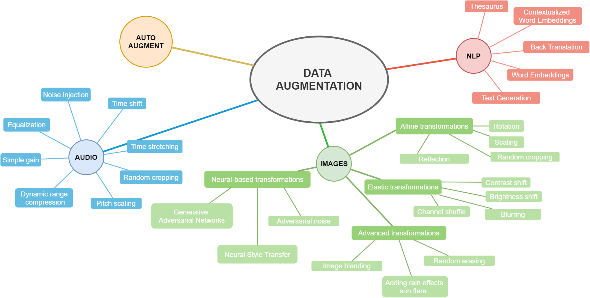
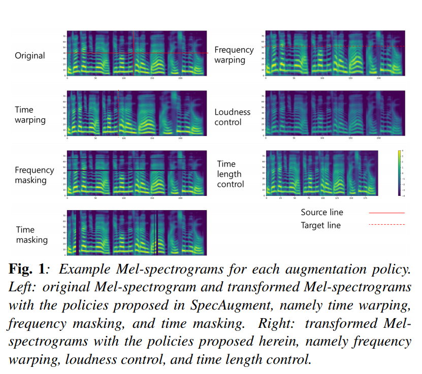
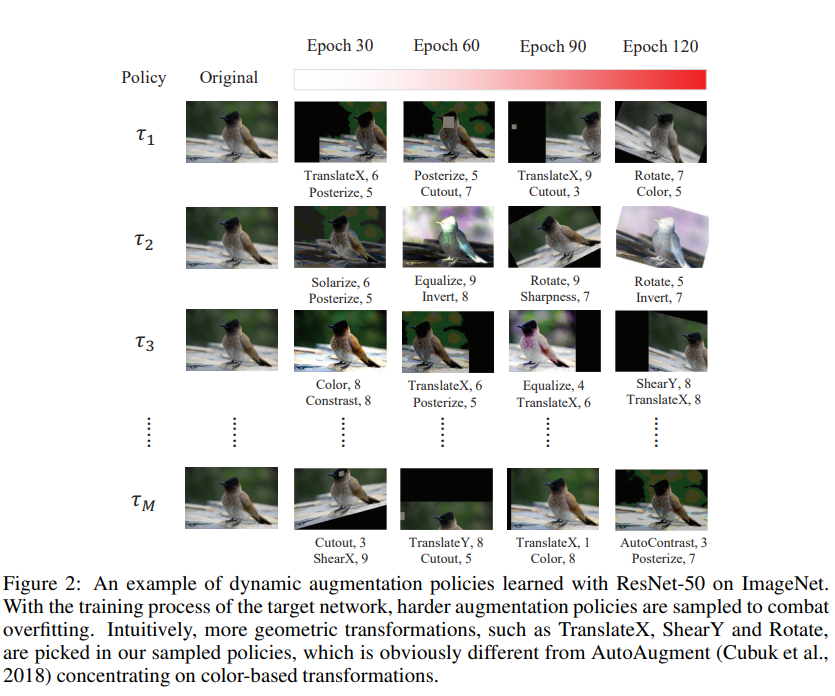
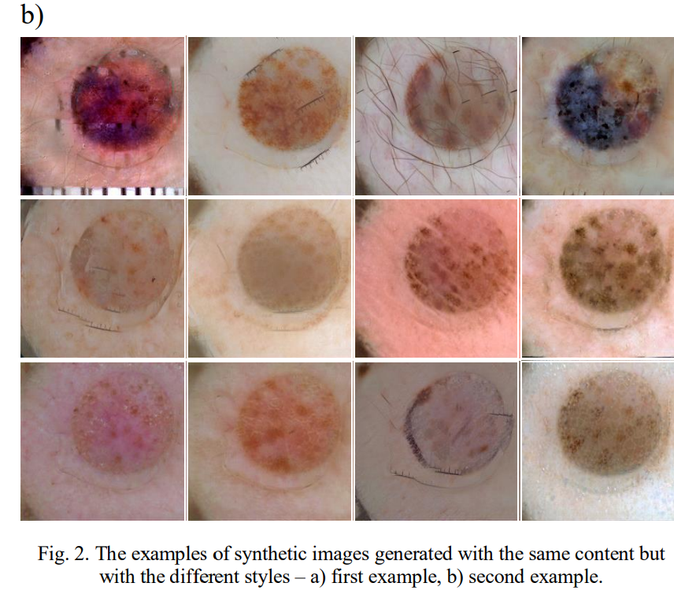
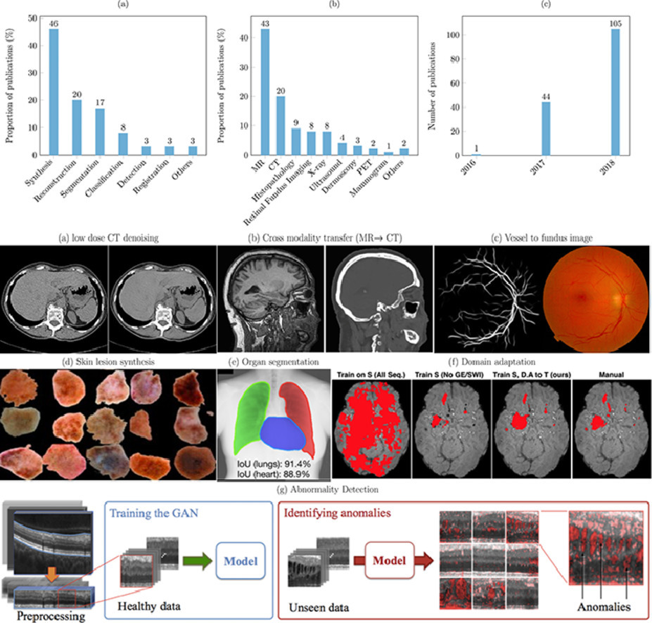
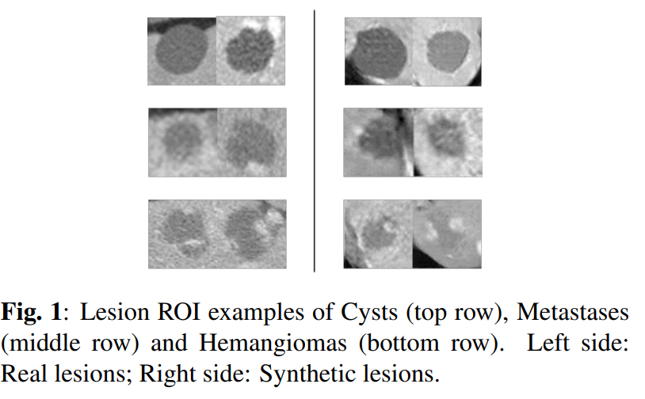

# Data augmentation
List of useful data augmentation resources. You will find here some links to more or less popular github repos :sparkles:, libraries, papers :books: and other information.

Do you like it? Feel free to :star: !
Feel free to pull request!

* [Introduction](https://github.com/AgaMiko/data-augmentation-review/blob/master/README.md#Introduction)
* [Repositories](https://github.com/AgaMiko/data-augmentation-review/blob/master/README.md#Repositories)
* [Papers](https://github.com/AgaMiko/data-augmentation-review/blob/master/README.md#Papers)
* [AutoAugment - repos and papers](https://github.com/AgaMiko/data-augmentation-review/blob/master/README.md#AutoAugment)
* [Other - challenges, workshops, tutorials, books](https://github.com/AgaMiko/data-augmentation-review/blob/master/README.md#Other)

# Introduction
Data augmentation can be simply described as any method that makes our dataset larger. To create more images for example, we could zoom the in and save a result, we could change the brightness of the image or rotate it. To get bigger sound dataset we could try raise or lower the pitch of the audio sample or slow down/speed up.
Example data augmentation techniques are presented on the diagram below.

## DATA AUGMENTATION
* ### Images
	* Affine transformations
		* Rotation
		* Scaling
		* Random cropping
		* Reflection
	* Elastic transformations
		* Contrast shift
		* Brightness shift
		* Blurring
		* Channel shuffle
	* Advanced transformations
		* Random erasing
		* Adding rain effects, sun flare...
		* Image blending
	* Neural-based transformations
		* Adversarial noise
		* Neural Style Transfer
		* Generative Adversarial Networks
* ### Audio
	* Noise injection
	* Time shift
	* Time stretching
	* Random cropping
	* Pitch scaling
	* Dynamic range compression
	* Simple gain
	* Equalization
* ### Natural Language Processing
	* Thesaurus
	* Text Generation
	* Back Translation
	* Word Embeddings
	* Contextualized Word Embeddings
	* Voice conversion
* ### AutoAugment

If you wish to cite us, you can cite followings paper of your choice:  [Style transfer-based image synthesis as an efficient regularization technique in deep learning](https://ieeexplore.ieee.org/document/8864616) or [Data augmentation for improving deep learning in image classification problem](https://ieeexplore.ieee.org/document/8388338).

# Repositories

## Computer vision

#### - [albumentations](https://github.com/albu/albumentations)  is a python library with a set of useful, large and diverse data augmentation methods. It offers over 30 different types of augmentations, easy and ready to use. Moreover, as the authors prove, the library is faster than other libraries on most of the transformations. 

Example jupyter notebooks:
* [All in one showcase notebook](https://github.com/albu/albumentations/blob/master/notebooks/showcase.ipynb)
* [Classification](https://github.com/albu/albumentations/blob/master/notebooks/example.ipynb),
* [Object detection](https://github.com/albu/albumentations/blob/master/notebooks/example_bboxes.ipynb),  [image segmentation](https://github.com/albu/albumentations/blob/master/notebooks/example_kaggle_salt.ipynb) and  [keypoints](https://github.com/albu/albumentations/blob/master/notebooks/example_keypoints.ipynb)
* Others - [Weather transforms ](https://github.com/albu/albumentations/blob/master/notebooks/example_weather_transforms.ipynb),
 [Serialization](https://github.com/albu/albumentations/blob/master/notebooks/serialization.ipynb),
 [Replay/Deterministic mode](https://github.com/albu/albumentations/blob/master/notebooks/replay.ipynb),  [Non-8-bit images](https://github.com/albu/albumentations/blob/master/notebooks/example_16_bit_tiff.ipynb)

Example tranformations:

#### - [imgaug](https://github.com/aleju/imgaug)  - is another very useful and widely used python library. As authors describe: *it helps you with augmenting images for your machine learning projects. It converts a set of input images into a new, much larger set of slightly altered images.* It offers many augmentation techniques such as affine transformations, perspective transformations, contrast changes, gaussian noise, dropout of regions, hue/saturation changes, cropping/padding, blurring.

Example jupyter notebooks:
* [Load and Augment an Image](https://nbviewer.jupyter.org/github/aleju/imgaug-doc/blob/master/notebooks/A01%20-%20Load%20and%20Augment%20an%20Image.ipynb)
* [Multicore Augmentation](https://nbviewer.jupyter.org/github/aleju/imgaug-doc/blob/master/notebooks/A03%20-%20Multicore%20Augmentation.ipynb)
 * Augment and work with: [Keypoints/Landmarks](https://nbviewer.jupyter.org/github/aleju/imgaug-doc/blob/master/notebooks/B01%20-%20Augment%20Keypoints.ipynb),
    [Bounding Boxes](https://nbviewer.jupyter.org/github/aleju/imgaug-doc/blob/master/notebooks/B02%20-%20Augment%20Bounding%20Boxes.ipynb),
    [Polygons](https://nbviewer.jupyter.org/github/aleju/imgaug-doc/blob/master/notebooks/B03%20-%20Augment%20Polygons.ipynb),
    [Line Strings](https://nbviewer.jupyter.org/github/aleju/imgaug-doc/blob/master/notebooks/B06%20-%20Augment%20Line%20Strings.ipynb),
    [Heatmaps](https://nbviewer.jupyter.org/github/aleju/imgaug-doc/blob/master/notebooks/B04%20-%20Augment%20Heatmaps.ipynb),
    [Segmentation Maps](https://nbviewer.jupyter.org/github/aleju/imgaug-doc/blob/master/notebooks/B05%20-%20Augment%20Segmentation%20Maps.ipynb) 

Example tranformations:

#### - [UDA](https://github.com/google-research/uda) - a simple data augmentation tool for image files, intended for use with machine learning data sets. The tool scans a directory containing image files, and generates new images by performing a specified set of augmentation operations on each file that it finds. This process multiplies the number of training examples that can be used when developing a neural network, and should significantly improve the resulting network's performance, particularly when the number of training examples is relatively small.
The details are avaible here: [UNSUPERVISED DATA AUGMENTATION FOR CONSISTENCY TRAINING](https://arxiv.org/pdf/1904.12848.pdf)

#### - [Data augmentation for object detection](https://github.com/Paperspace/DataAugmentationForObjectDetection)  - Repository contains a code for the paper [space tutorial series on adapting data augmentation methods for object detection tasks](https://blog.paperspace.com/data-augmentation-for-bounding-boxes/). They support a lot of data augmentations, like Horizontal Flipping, Scaling, Translation, Rotation, Shearing, Resizing.

#### - [FMix - Understanding and Enhancing Mixed Sample Data Augmentation](https://github.com/ecs-vlc/FMix)  This repository contains the official implementation of the paper ['Understanding and Enhancing Mixed Sample Data Augmentation'](https://arxiv.org/abs/2002.12047)

#### - [Super-AND](https://github.com/super-AND/super-AND)  - This repository is the Pytorch implementation of "A Comprehensive Approach to Unsupervised Embedding Learning based on AND Algorithm. 

#### - [vidaug](https://github.com/okankop/vidaug)  - This python library helps you with augmenting videos for your deep learning architectures. It converts input videos into a new, much larger set of slightly altered videos.

#### - [Image augmentor](https://github.com/codebox/image_augmentor)  - This is a simple python data augmentation tool for image files, intended for use with machine learning data sets. The tool scans a directory containing image files, and generates new images by performing a specified set of augmentation operations on each file that it finds. This process multiplies the number of training examples that can be used when developing a neural network, and should significantly improve the resulting network's performance, particularly when the number of training examples is relatively small.

#### - [torchsample](https://github.com/ncullen93/torchsample)  - this python package provides High-Level Training, Data Augmentation, and Utilities for Pytorch. This toolbox provides data augmentation methods, regularizers and other utility functions. These transforms work directly on torch tensors:
* Compose()
* AddChannel()
* SwapDims()
* RangeNormalize()
* StdNormalize()
* Slice2D()
* RandomCrop()
* SpecialCrop()
* Pad()
* RandomFlip()

#### - [Random erasing](https://github.com/zhunzhong07/Random-Erasing)  - The code is based on the paper: https://arxiv.org/abs/1708.04896. The Absract:

In this paper, we introduce Random Erasing, a new data augmentation method for training the convolutional neural network (CNN). In training, Random Erasing randomly selects a rectangle region in an image and erases its pixels with random values. In this process, training images with various levels of occlusion are generated, which reduces the risk of over-fitting and makes the model robust to occlusion. Random Erasing is parameter learning free, easy to implement, and can be integrated with most of the CNN-based recognition models. Albeit simple, Random Erasing is complementary to commonly used data augmentation techniques such as random cropping and flipping, and yields consistent improvement over strong baselines in image classification, object detection and person re-identification. Code is available at: this https URL.

#### - [data augmentation in C++](https://github.com/takmin/DataAugmentation) -  Simple image augmnetation program transform input images with rotation, slide, blur, and noise to create training data of image recognition.

#### - [Data augmentation with GANs](https://github.com/AntreasAntoniou/DAGAN)  - This repository contain files with Generative Adversarial Network, which can be used to successfully augment the dataset. This is an implementation of DAGAN as described in https://arxiv.org/abs/1711.04340. The implementation provides data loaders, model builders, model trainers, and synthetic data generators for the Omniglot and VGG-Face datasets.

#### - [Joint Discriminative and Generative Learning](https://github.com/NVlabs/DG-Net)  - This repo is for Joint Discriminative and Generative Learning for Person Re-identification (CVPR2019 Oral). The author proposes an end-to-end training network that simultaneously generates more training samples and conducts representation learning. Given N real samples, the network could generate O(NxN) high-fidelity samples.

[[Project]](http://zdzheng.xyz/DG-Net/) [[Paper]](https://arxiv.org/abs/1904.07223) [[YouTube]](https://www.youtube.com/watch?v=ubCrEAIpQs4) [[Bilibili]](https://www.bilibili.com/video/av51439240) [[Poster]](http://zdzheng.xyz/images/DGNet_poster.pdf)
[[Supp]](http://jankautz.com/publications/JointReID_CVPR19_supp.pdf)

#### - [White-Balance Emulator for Color Augmentation](https://github.com/mahmoudnafifi/WB_color_augmenter)  - Our augmentation method can accurately emulate realistic color constancy degradation. Existing color augmentation methods often generate unrealistic colors which rarely happen in reality (e.g., green skin or purple grass). More importantly, the visual appearance of existing color augmentation techniques does not well represent the color casts produced by incorrect WB applied onboard cameras, as shown below. [python] [matlab]

## Natural Language Processing

#### - [Contextual data augmentation](https://github.com/pfnet-research/contextual_augmentation) - Contextual augmentation is a domain-independent data augmentation for text classification tasks. Texts in supervised dataset are augmented by replacing words with other words which are predicted by a label-conditioned bi-directional language model. 
This repository contains a collection of scripts for an experiment of [Contextual Augmentation](https://arxiv.org/pdf/1805.06201.pdf).

 

#### - [nlpaug](https://github.com/makcedward/nlpaug)   - This python library helps you with augmenting nlp for your machine learning projects. Visit this introduction to understand about [Data Augmentation in NLP](https://towardsdatascience.com/data-augmentation-in-nlp-2801a34dfc28). `Augmenter` is the basic element of augmentation while `Flow` is a pipeline to orchestra multi augmenter together.

Features:
 *   Generate synthetic data for improving model performance without manual effort
 *   Simple, easy-to-use and lightweight library. Augment data in 3 lines of code
 *   Plug and play to any neural network frameworks (e.g. PyTorch, TensorFlow)
 *   Support textual and audio input

#### - [EDA NLP](https://github.com/jasonwei20/eda_nlp)   - **EDA** is an **e**asy **d**ata **a**ugmentation techniques for boosting performance on text classification tasks. These are a generalized set of data augmentation techniques that are easy to implement and have shown improvements on five NLP classification tasks, with substantial improvements on datasets of size `N < 500`. While other techniques require you to train a language model on an external dataset just to get a small boost, we found that simple text editing operations using EDA result in good performance gains. Given a sentence in the training set, we perform the following operations:

- **Synonym Replacement (SR):** Randomly choose *n* words from the sentence that are not stop words. Replace each of these words with one of its synonyms chosen at random.
- **Random Insertion (RI):** Find a random synonym of a random word in the sentence that is not a stop word. Insert that synonym into a random position in the sentence. Do this *n* times.
- **Random Swap (RS):** Randomly choose two words in the sentence and swap their positions. Do this *n* times.
- **Random Deletion (RD):** For each word in the sentence, randomly remove it with probability *p*.

## Audio
#### - [SpecAugment with Pytorch](https://github.com/zcaceres/spec_augment)  - (https://ai.googleblog.com/2019/04/specaugment-new-data-augmentation.html) is a state of the art data augmentation approach for speech recognition. It supports augmentations such as time wrap, time mask, frequency mask or all above combined.

#### - [Audiomentations](https://github.com/iver56/audiomentations)  - A Python library for audio data augmentation. Inspired by albumentations. Useful for machine learning. It allows to use effects such as: Compose, AddGaussianNoise, TimeStretch, PitchShift and Shift.

#### - [MUDA](https://github.com/bmcfee/muda)  - A library for Musical Data Augmentation. Muda package implements annotation-aware musical data augmentation, as described in the muda paper.
The goal of this package is to make it easy for practitioners to consistently apply perturbations to annotated music data for the purpose of fitting statistical models.

# Papers
## 2020
* [Attribute Mix: Semantic Data Augmentation for Fine Grained Recognition](https://arxiv.org/abs/2004.02684);Hao Li, Xiaopeng Zhang, Hongkai Xiong, Qi Tian ; Collecting fine-grained labels usually requires expert-level domain knowledge and is prohibitive to scale up. In this paper, we propose Attribute Mix, a data augmentation strategy at attribute level to expand the fine-grained samples. The principle lies in that attribute features are shared among fine-grained sub-categories, and can be seamlessly transferred among images. Toward this goal, we propose an automatic attribute mining approach to discover attributes that belong to the same super-category, and Attribute Mix is operated by mixing semantically meaningful attribute features from two images. Attribute Mix is a simple but effective data augmentation strategy that can significantly improve the recognition performance without increasing the inference budgets. Furthermore, since attributes can be shared among images from the same super-category, we further enrich the training samples with attribute level labels using images from the generic domain. Experiments on widely used fine-grained benchmarks demonstrate the effectiveness of our proposed method. Specifically, without any bells and whistles, we achieve accuracies of 90.2%, 93.1% and 94.9% on CUB-200-2011, FGVC-Aircraft and Standford Cars, respectively.

* [Dictionary-based Data Augmentation for Cross-Domain Neural Machine Translation](https://arxiv.org/abs/2004.02577); Wei Peng, Chongxuan Huang, Tianhao Li, Yun Chen, Qun Liu ;
Existing data augmentation approaches for neural machine translation (NMT) have predominantly relied on back-translating in-domain (IND) monolingual corpora. These methods suffer from issues associated with a domain information gap, which leads to translation errors for low frequency and out-of-vocabulary terminology. This paper proposes a dictionary-based data augmentation (DDA) method for cross-domain NMT. DDA synthesizes a domain-specific dictionary with general domain corpora to automatically generate a large-scale pseudo-IND parallel corpus. The generated pseudo-IND data can be used to enhance a general domain trained baseline. The experiments show that the DDA-enhanced NMT models demonstrate consistent significant improvements, outperforming the baseline models by 3.75-11.53 BLEU. The proposed method is also able to further improve the performance of the back-translation based and IND-finetuned NMT models. The improvement is associated with the enhanced domain coverage produced by DDA.

* [Imbalanced Data Learning by Minority Class Augmentation using Capsule Adversarial Networks](https://arxiv.org/abs/2004.02182);Pourya Shamsolmoali, Masoumeh Zareapoor, Linlin Shen, Abdul Hamid Sadka, Jie Yang ; The fact that image datasets are often imbalanced poses an intense challenge for deep learning techniques. In this paper, we propose a method to restore the balance in imbalanced images, by coalescing two concurrent methods, generative adversarial networks (GANs) and capsule network. In our model, generative and discriminative networks play a novel competitive game, in which the generator generates samples towards specific classes from multivariate probabilities distribution. The discriminator of our model is designed in a way that while recognizing the real and fake samples, it is also requires to assign classes to the inputs. Since GAN approaches require fully observed data during training, when the training samples are imbalanced, the approaches might generate similar samples which leading to data overfitting. This problem is addressed by providing all the available information from both the class components jointly in the adversarial training. It improves learning from imbalanced data by incorporating the majority distribution structure in the generation of new minority samples. Furthermore, the generator is trained with feature matching loss function to improve the training convergence. In addition, prevents generation of outliers and does not affect majority class space. The evaluations show the effectiveness of our proposed methodology; in particular, the coalescing of capsule-GAN is effective at recognizing highly overlapping classes with much fewer parameters compared with the convolutional-GAN.

* [DADA: Differentiable Automatic Data Augmentation](https://arxiv.org/abs/2003.03780);Yonggang Li, Guosheng Hu, Yongtao Wang, Timothy Hospedales, Neil M. Robertson, Yongxing Yang; Data augmentation (DA) techniques aim to increase data variability, and thus train deep networks with better generalisation. The pioneering AutoAugment automated the search for optimal DA policies with reinforcement learning. However, AutoAugment is extremely computationally expensive, limiting its wide applicability. Followup work such as PBA and Fast AutoAugment improved efficiency, but optimization speed remains a bottleneck. In this paper, we propose Differentiable Automatic Data Augmentation (DADA) which dramatically reduces the cost. DADA relaxes the discrete DA policy selection to a differentiable optimization problem via Gumbel-Softmax. In addition, we introduce an unbiased gradient estimator, RELAX, leading to an efficient and effective one-pass optimization strategy to learn an efficient and accurate DA policy. We conduct extensive experiments on CIFAR-10, CIFAR-100, SVHN, and ImageNet datasets. Furthermore, we demonstrate the value of Auto DA in pre-training for downstream detection problems. Results show our DADA is at least one order of magnitude faster than the state-of-the-art while achieving very comparable accuracy. 

* [Data Augmentation using Pre-trained Transformer Models](https://arxiv.org/abs/2003.02245); Varun Kumar, Ashutosh Choudhary, Eunah Cho; Language model based pre-trained models such as BERT have provided significant gains across different NLP tasks. In this paper, we study different types of pre-trained transformer based models such as auto-regressive models (GPT-2), auto-encoder models (BERT), and seq2seq models (BART) for conditional data augmentation. We show that prepending the class labels to text sequences provides a simple yet effective way to condition the pre-trained models for data augmentation. On three classification benchmarks, pre-trained Seq2Seq model outperforms other models. Further, we explore how different pre-trained model based data augmentation differs in-terms of data diversity, and how well such methods preserve the class-label information. ;

* [SuperMix: Supervising the Mixing Data Augmentation](https://arxiv.org/abs/2003.05034); Ali Dabouei, Sobhan Soleymani, Fariborz Taherkhani, Nasser M. Nasrabadi  ; In this paper, we propose a supervised mixing augmentation method, termed SuperMix, which exploits the knowledge of a teacher to mix images based on their salient regions. SuperMix optimizes a mixing objective that considers: i) forcing the class of input images to appear in the mixed image, ii) preserving the local structure of images, and iii) reducing the risk of suppressing important features. To make the mixing suitable for large-scale applications, we develop an optimization technique, 
65× faster than gradient descent on the same problem. We validate the effectiveness of SuperMix through extensive evaluations and ablation studies on two tasks of object classification and knowledge distillation. On the classification task, SuperMix provides the same performance as the advanced augmentation methods, such as AutoAugment. On the distillation task, SuperMix sets a new state-of-the-art with a significantly simplified distillation method. Particularly, in six out of eight teacher-student setups from the same architectures, the students trained on the mixed data surpass their teachers with a notable margin. 

* [Fast Cross-domain Data Augmentation through Neural Sentence Editing](https://arxiv.org/abs/2003.10254); Guillaume Raille, Sandra Djambazovska, Claudiu Musat;
Data augmentation promises to alleviate data scarcity. This is most important in cases where the initial data is in short supply. This is, for existing methods, also where augmenting is the most difficult, as learning the full data distribution is impossible. For natural language, sentence editing offers a solution - relying on small but meaningful changes to the original ones. Learning which changes are meaningful also requires large amounts of training data. We thus aim to learn this in a source domain where data is abundant and apply it in a different, target domain, where data is scarce - cross-domain augmentation. 
We create the Edit-transformer, a Transformer-based sentence editor that is significantly faster than the state of the art and also works cross-domain. We argue that, due to its structure, the Edit-transformer is better suited for cross-domain environments than its edit-based predecessors. We show this performance gap on the Yelp-Wikipedia domain pairs. Finally, we show that due to this cross-domain performance advantage, the Edit-transformer leads to meaningful performance gains in several downstream tasks

* [GridMask Data Augmentation](https://arxiv.org/abs/2001.04086); Pengguang Chen;
We propose a novel data augmentation method GridMask in this paper. It utilizes information removal to achieve state-of-the-art results in a variety of computer vision tasks. We analyze the requirement of information dropping. Then we show limitation of existing information dropping algorithms and propose our structured method, which is simple and yet very effective. It is based on the deletion of regions of the input image. Our extensive experiments show that our method outperforms the latest AutoAugment, which is way more computationally expensive due to the use of reinforcement learning to find the best policies. On the ImageNet dataset for recognition, COCO2017 object detection, and on Cityscapes dataset for semantic segmentation, our method all notably improves performance over baselines. The extensive experiments manifest the effectiveness and generality of the new method.

* [Mel-spectrogram augmentation for sequence to sequence voice conversion](https://arxiv.org/abs/2001.01401); Yeongtae Hwang, Hyemin Cho, Hongsun Yang, Insoo Oh, Seong-Whan Lee;
When training the sequence-to-sequence voice conversion model, we need to handle an issue of insufficient data about the number of speech tuples which consist of the same utterance. This study experimentally investigated the effects of Mel-spectrogram augmentation on the sequence-to-sequence voice conversion model. For Mel-spectrogram augmentation, we adopted the policies proposed in SpecAugment. In addition, we propose new policies for more data variations. To find the optimal hyperparameters of augmentation policies for voice conversion, we experimented based on the new metric, namely deformation per deteriorating ratio. We observed the effect of these through experiments based on various sizes of training set and combinations of augmentation policy. In the experimental results, the time axis warping based policies showed better performance than other policies.

* [Data Augmentation by AutoEncoders for Unsupervised Anomaly Detection](https://arxiv.org/abs/1912.13384);Kasra Babaei, ZhiYuan Chen, Tomas Maul;
This paper proposes an autoencoder (AE) that is used for improving the performance of once-class classifiers for the purpose of detecting anomalies. Traditional one-class classifiers (OCCs) perform poorly under certain conditions such as high-dimensionality and sparsity. Also, the size of the training set plays an important role on the performance of one-class classifiers. Autoencoders have been widely used for obtaining useful latent variables from high-dimensional datasets. In the proposed approach, the AE is capable of deriving meaningful features from high-dimensional datasets while doing data augmentation at the same time. The augmented data is used for training the OCC algorithms. The experimental results show that the proposed approach enhance the performance of OCC algorithms and also outperforms other well-known approaches.

* [Effective Data Augmentation with Multi-Domain Learning GANs](https://arxiv.org/abs/1912.11597);Shin'ya Yamaguchi, Sekitoshi Kanai, Takeharu Eda ;
For deep learning applications, the massive data development (e.g., collecting, labeling), which is an essential process in building practical applications, still incurs seriously high costs. In this work, we propose an effective data augmentation method based on generative adversarial networks (GANs), called Domain Fusion. Our key idea is to import the knowledge contained in an outer dataset to a target model by using a multi-domain learning GAN. The multi-domain learning GAN simultaneously learns the outer and target dataset and generates new samples for the target tasks. The simultaneous learning process makes GANs generate the target samples with high fidelity and variety. As a result, we can obtain accurate models for the target tasks by using these generated samples even if we only have an extremely low volume target dataset. We experimentally evaluate the advantages of Domain Fusion in image classification tasks on 3 target datasets: CIFAR-100, FGVC-Aircraft, and Indoor Scene Recognition. When trained on each target dataset reduced the samples to 5,000 images, Domain Fusion achieves better classification accuracy than the data augmentation using fine-tuned GANs. Furthermore, we show that Domain Fusion improves the quality of generated samples, and the improvements can contribute to higher accuracy.

* [Adversarial AutoAugment](https://arxiv.org/abs/1912.11188);Xinyu Zhang, Qiang Wang, Jian Zhang, Zhao Zhong ;
Data augmentation (DA) has been widely utilized to improve generalization in training deep neural networks. Recently, human-designed data augmentation has been gradually replaced by automatically learned augmentation policy. Through finding the best policy in well-designed search space of data augmentation, AutoAugment can significantly improve validation accuracy on image classification tasks. However, this approach is not computationally practical for large-scale problems. In this paper, we develop an adversarial method to arrive at a computationally-affordable solution called Adversarial AutoAugment, which can simultaneously optimize target related object and augmentation policy search loss. The augmentation policy network attempts to increase the training loss of a target network through generating adversarial augmentation policies, while the target network can learn more robust features from harder examples to improve the generalization. In contrast to prior work, we reuse the computation in target network training for policy evaluation, and dispense with the retraining of the target network. Compared to AutoAugment, this leads to about 12x reduction in computing cost and 11x shortening in time overhead on ImageNet. We show experimental results of our approach on CIFAR-10/CIFAR-100, ImageNet, and demonstrate significant performance improvements over state-of-the-art. On CIFAR-10, we achieve a top-1 test error of 1.36%, which is the currently best performing single model. On ImageNet, we achieve a leading performance of top-1 accuracy 79.40% on ResNet-50 and 80.00% on ResNet-50-D without extra data.

* [Imperfect ImaGANation: Implications of GANs Exacerbating Biases on Facial Data Augmentation and Snapchat Selfie Lenses](https://arxiv.org/abs/2001.09528);Niharika Jain, Alberto Olmo, Sailik Sengupta, Lydia Manikonda, Subbarao Kambhampati ; 
Recently, the use of synthetic data generated by GANs has become a popular method to do data augmentation for many applications. While practitioners celebrate this as an economical way to obtain synthetic data for training data-hungry machine learning models, it is not clear that they recognize the perils of such an augmentation technique when applied to an already-biased dataset. Although one expects GANs to replicate the distribution of the original data, in real-world settings with limited data and finite network capacity, GANs suffer from mode collapse. Especially when this data is coming from online social media platforms or the web which are never balanced. In this paper, we show that in settings where data exhibits bias along some axes (eg. gender, race), failure modes of Generative Adversarial Networks (GANs) exacerbate the biases in the generated data. More often than not, this bias is unavoidable; we empirically demonstrate that given input of a dataset of headshots of engineering faculty collected from 47 online university directory webpages in the United States is biased toward white males, a state-of-the-art (unconditional variant of) GAN "imagines" faces of synthetic engineering professors that have masculine facial features and white skin color (inferred using human studies and a state-of-the-art gender recognition system). We also conduct a preliminary case study to highlight how Snapchat's explosively popular "female" filter (widely accepted to use a conditional variant of GAN), ends up consistently lightening the skin tones in women of color when trying to make face images appear more feminine. Our study is meant to serve as a cautionary tale for the lay practitioners who may unknowingly increase the bias in their training data by using GAN-based augmentation techniques with web data and to showcase the dangers of using biased datasets for facial applications.

 * [Understanding and Enhancing Mixed Sample Data Augmentation](https://arxiv.org/abs/2002.12047);Ethan Harris, Antonia Marcu, Matthew Painter, Mahesan Niranjan, Adam Prügel-Bennett, Jonathon Hare ; Mixed Sample Data Augmentation (MSDA) has received increasing attention in recent years, with many successful variants such as MixUp and CutMix. Following insight on the efficacy of CutMix in particular, we propose FMix, an MSDA that uses binary masks obtained by applying a threshold to low frequency images sampled from Fourier space. FMix improves performance over MixUp and CutMix for a number of state-of-the-art models across a range of data sets and problem settings. We go on to analyse MixUp, CutMix, and FMix from an information theoretic perspective, characterising learned models in terms of how they progressively compress the input with depth. Ultimately, our analyses allow us to decouple two complementary properties of augmentations, and present a unified framework for reasoning about MSDA. Code for all experiments is available at this [https URL](https://github.com/ecs-vlc/FMix).
 
 * [Improving Generalization by Controlling Label-Noise Information in Neural Network Weights](https://arxiv.org/abs/2002.07933);Hrayr Harutyunyan, Kyle Reing, Greg Ver Steeg, Aram Galstyan; In the presence of noisy or incorrect labels, neural networks have the undesirable tendency to memorize information about the noise. Standard regularization techniques such as dropout, weight decay or data augmentation sometimes help, but do not prevent this behavior. If one considers neural network weights as random variables that depend on the data and stochasticity of training, the amount of memorized information can be quantified with the Shannon mutual information between weights and the vector of all training labels given inputs, I(w:y∣x). We show that for any training algorithm, low values of this term correspond to reduction in memorization of label-noise and better generalization bounds. To obtain these low values, we propose training algorithms that employ an auxiliary network that predicts gradients in the final layers of a classifier without accessing labels. We illustrate the effectiveness of our approach on versions of MNIST, CIFAR-10, and CIFAR-100 corrupted with various noise models, and on a large-scale dataset Clothing1M that has noisy labels.
 
 * [Learning Robust Representations via Multi-View Information Bottleneck](https://arxiv.org/abs/2002.07017);Marco Federici, Anjan Dutta, Patrick Forré, Nate Kushman, Zeynep Akata ; The information bottleneck principle provides an information-theoretic method for representation learning, by training an encoder to retain all information which is relevant for predicting the label while minimizing the amount of other, excess information in the representation. The original formulation, however, requires labeled data to identify the superfluous information. In this work, we extend this ability to the multi-view unsupervised setting, where two views of the same underlying entity are provided but the label is unknown. This enables us to identify superfluous information as that not shared by both views. A theoretical analysis leads to the definition of a new multi-view model that produces state-of-the-art results on the Sketchy dataset and label-limited versions of the MIR-Flickr dataset. We also extend our theory to the single-view setting by taking advantage of standard data augmentation techniques, empirically showing better generalization capabilities when compared to common unsupervised approaches for representation learning. [**CODE**](https://github.com/mfederici/Multi-View-Information-Bottleneck)
 
 * [Small energy masking for improved neural network training for end-to-end speech recognition](https://arxiv.org/abs/2002.06312);Chanwoo Kim, Kwangyoun Kim, Sathish Reddy Indurthi ; In this paper, we present a Small Energy Masking (SEM) algorithm, which masks inputs having values below a certain threshold. More specifically, a time-frequency bin is masked if the filterbank energy in this bin is less than a certain energy threshold. A uniform distribution is employed to randomly generate the ratio of this energy threshold to the peak filterbank energy of each utterance in decibels. The unmasked feature elements are scaled so that the total sum of the feature values remain the same through this masking procedure. This very simple algorithm shows relatively 11.2 % and 13.5 % Word Error Rate (WER) improvements on the standard LibriSpeech test-clean and test-other sets over the baseline end-to-end speech recognition system. Additionally, compared to the input dropout algorithm, SEM algorithm shows relatively 7.7 % and 11.6 % improvements on the same LibriSpeech test-clean and test-other sets. With a modified shallow-fusion technique with a Transformer LM, we obtained a 2.62 % WER on the LibriSpeech test-clean set and a 7.87 % WER on the LibriSpeech test-other set.
 

## 2019
* [Occlusions for Effective Data Augmentation in Image Classification](https://arxiv.org/abs/1910.10651); Ruth Fong, Andrea Vedaldi; Deep networks for visual recognition are known to leverage "easy to recognise" portions of objects such as faces and distinctive texture patterns. The lack of a holistic understanding of objects may increase fragility and overfitting. In recent years, several papers have proposed to address this issue by means of occlusions as a form of data augmentation. However, successes have been limited to tasks such as weak localization and model interpretation, but no benefit was demonstrated on image classification on large-scale datasets. In this paper, we show that, by using a simple technique based on batch augmentation, occlusions as data augmentation can result in better performance on ImageNet for high-capacity models (e.g., ResNet50). We also show that varying amounts of occlusions used during training can be used to study the robustness of different neural network architectures.

* [CutMix: Regularization Strategy to Train Strong Classifiers with Localizable Features](https://arxiv.org/abs/1905.04899); Sangdoo Yun, Dongyoon Han, Seong Joon Oh, Sanghyuk Chun, Junsuk Choe, Youngjoon Yoo; Regional dropout strategies have been proposed to enhance the performance of convolutional neural network classifiers. They have proved to be effective for guiding the model to attend on less discriminative parts of objects (e.g. leg as opposed to head of a person), thereby letting the network generalize better and have better object localization capabilities. On the other hand, current methods for regional dropout remove informative pixels on training images by overlaying a patch of either black pixels or random noise. Such removal is not desirable because it leads to information loss and inefficiency during training. We therefore propose the CutMix augmentation strategy: patches are cut and pasted among training images where the ground truth labels are also mixed proportionally to the area of the patches. By making efficient use of training pixels and retaining the regularization effect of regional dropout, CutMix consistently outperforms the state-of-the-art augmentation strategies on CIFAR and ImageNet classification tasks, as well as on the ImageNet weakly-supervised localization task. Moreover, unlike previous augmentation methods, our CutMix-trained ImageNet classifier, when used as a pretrained model, results in consistent performance gains in Pascal detection and MS-COCO image captioning benchmarks. We also show that CutMix improves the model robustness against input corruptions and its out-of-distribution detection performances.

* [Style transfer-based image synthesis as an efficient regularization technique in deep learning](https://arxiv.org/abs/1905.10974); Agnieszka Mikołajczyk, Michał Grochowski; These days deep learning is the fastest-growing area in the field of Machine Learning. Convolutional Neural Networks are currently the main tool used for image analysis and classification purposes. Although great achievements and perspectives, deep neural networks and accompanying learning algorithms have some relevant challenges to tackle. In this paper, we have focused on the most frequently mentioned problem in the field of machine learning, that is relatively poor generalization abilities. Partial remedies for this are regularization techniques eg dropout, batch normalization, weight decay, transfer learning, early stopping and data augmentation. In this paper, we have focused on data augmentation. We propose to use a method based on a neural style transfer, which allows generating new unlabeled images of a high perceptual quality that combine the content of a base image with the appearance of another one. In a proposed approach, the newly created images are described with pseudo-labels, and then used as a training dataset. Real, labeled images are divided into the validation and test set. We validated the proposed method on a challenging skin lesion classification case study. Four representative neural architectures are examined. Obtained results show the strong potential of the proposed approach.

* [Generative adversarial network in medical imaging: A review](https://www.sciencedirect.com/science/article/abs/pii/S1361841518308430); Xin Yi, Ekta Walia, Paul Babyna; Generative adversarial networks have gained a lot of attention in the computer vision community due to their capability of data generation without explicitly modelling the probability density function. The adversarial loss brought by the discriminator provides a clever way of incorporating unlabeled samples into training and imposing higher order consistency. This has proven to be useful in many cases, such as domain adaptation, data augmentation, and image-to-image translation. These properties have attracted researchers in the medical imaging community, and we have seen rapid adoption in many traditional and novel applications, such as image reconstruction, segmentation, detection, classification, and cross-modality synthesis. Based on our observations, this trend will continue and we therefore conducted a review of recent advances in medical imaging using the adversarial training scheme with the hope of benefiting researchers interested in this technique.

* [Data Augmentation via Dependency Tree Morphing for Low-Resource Languages](https://arxiv.org/abs/1903.09460); Gözde Gül Şahin, Mark Steedman; Neural NLP systems achieve high scores in the presence of sizable training dataset. Lack of such datasets leads to poor system performances in the case low-resource languages. We present two simple text augmentation techniques using dependency trees, inspired from image processing. We crop sentences by removing dependency links, and we rotate sentences by moving the tree fragments around the root. We apply these techniques to augment the training sets of low-resource languages in Universal Dependencies project. We implement a character-level sequence tagging model and evaluate the augmented datasets on part-of-speech tagging task. We show that crop and rotate provides improvements over the models trained with non-augmented data for majority of the languages, especially for languages with rich case marking systems.

* [Data augmentation for instrument classification robust to audio effects](https://arxiv.org/abs/1907.08520); António Ramires, Xavier Serra; Reusing recorded sounds (sampling) is a key component in Electronic Music Production (EMP), which has been present since its early days and is at the core of genres like hip-hop or jungle. Commercial and non-commercial services allow users to obtain collections of sounds (sample packs) to reuse in their compositions. Automatic classification of one-shot instrumental sounds allows automatically categorising the sounds contained in these collections, allowing easier navigation and better characterisation. Automatic instrument classification has mostly targeted the classification of unprocessed isolated instrumental sounds or detecting predominant instruments in mixed music tracks. For this classification to be useful in audio databases for EMP, it has to be robust to the audio effects applied to unprocessed sounds. In this paper we evaluate how a state of the art model trained with a large dataset of one-shot instrumental sounds performs when classifying instruments processed with audio effects. In order to evaluate the robustness of the model, we use data augmentation with audio effects and evaluate how each effect influences the classification accuracy.

* [Hyperspectral Image Classification Using Random Occlusion Data Augmentation](https://ieeexplore.ieee.org/abstract/document/8694852); Juan Mario Haut, Mercedes E. Paoletti, Javier Plaza, Antonio Plaza, Jun Li ; Convolutional neural networks (CNNs) have become a powerful tool for remotely sensed hyperspectral image (HSI) classification due to their great generalization ability and high accuracy. However, owing to the huge amount of parameters that need to be learned and to the complex nature of HSI data itself, these approaches must deal with the important problem of overfitting, which can lead to inadequate generalization and loss of accuracy. In order to mitigate this problem, in this letter, we adopt random occlusion, a recently developed data augmentation (DA) method for training CNNs, in which the pixels of different rectangular spatial regions in the HSI are randomly occluded, generating training images with various levels of occlusion and reducing the risk of overfitting. Our results with two well-known HSIs reveal that the proposed method helps to achieve better classification accuracy with low computational cost.

* [Learning Data Manipulation for Augmentation and Weighting](https://arxiv.org/abs/1910.12795); Zhiting Hu, Bowen Tan, Ruslan Salakhutdinov, Tom Mitchell, Eric P. Xing; Manipulating data, such as weighting data examples or augmenting with new instances, has been increasingly used to improve model training. Previous work has studied various rule- or learning-based approaches designed for specific types of data manipulation. In this work, we propose a new method that supports learning different manipulation schemes with the same gradient-based algorithm. Our approach builds upon a recent connection of supervised learning and reinforcement learning (RL), and adapts an off-the-shelf reward learning algorithm from RL for joint data manipulation learning and model training. Different parameterization of the "data reward" function instantiates different manipulation schemes. We showcase data augmentation that learns a text transformation network, and data weighting that dynamically adapts the data sample importance. Experiments show the resulting algorithms significantly improve the image and text classification performance in low data regime and class-imbalance problems.

* [Anatomically-Informed Data Augmentation for functional MRI with Applications to Deep Learning](https://arxiv.org/abs/1910.08112) ;Kevin P. Nguyen, Cherise Chin Fatt, Alex Treacher, Cooper Mellema, Madhukar H. Trivedi, Albert Montillo ; The application of deep learning to build accurate predictive models from functional neuroimaging data is often hindered by limited dataset sizes. Though data augmentation can help mitigate such training obstacles, most data augmentation methods have been developed for natural images as in computer vision tasks such as CIFAR, not for medical images. This work helps to fills in this gap by proposing a method for generating new functional Magnetic Resonance Images (fMRI) with realistic brain morphology. This method is tested on a challenging task of predicting antidepressant treatment response from pre-treatment task-based fMRI and demonstrates a 26% improvement in performance in predicting response using augmented images. This improvement compares favorably to state-of-the-art augmentation methods for natural images. Through an ablative test, augmentation is also shown to substantively improve performance when applied before hyperparameter optimization. These results suggest the optimal order of operations and support the role of data augmentation method for improving predictive performance in tasks using fMRI.

* [Image based fruit category classification by 13-layer deep convolutional neural network and data augmentation](https://link.springer.com/article/10.1007/s11042-017-5243-3); Yu-Dong Zhang, Zhengchao Dong, Xianqing Chen, Wenjuan Jia, Sidan Du, Khan Muhammad, Shui-Hua Wang ; Fruit category identification is important in factories, supermarkets, and other fields. Current computer vision systems used handcrafted features, and did not get good results. In this study, our team designed a 13-layer convolutional neural network (CNN). Three types of data augmentation method was used: image rotation, Gamma correction, and noise injection. We also compared max pooling with average pooling. The stochastic gradient descent with momentum was used to train the CNN with minibatch size of 128. The overall accuracy of our method is 94.94%, at least 5 percentage points higher than state-of-the-art approaches. We validated this 13-layer is the optimal structure. The GPU can achieve a 177× acceleration on training data, and a 175× acceleration on test data. We observed using data augmentation can increase the overall accuracy. Our method is effective in image-based fruit classification.

* [Data augmentation using learned transformations for one-shot medical image segmentation](https://arxiv.org/abs/1902.09383); Amy Zhao, Guha Balakrishnan, Frédo Durand, John V. Guttag, Adrian V. Dalca ; Image segmentation is an important task in many medical applications. Methods based on convolutional neural networks attain state-of-the-art accuracy; however, they typically rely on supervised training with large labeled datasets. Labeling medical images requires significant expertise and time, and typical hand-tuned approaches for data augmentation fail to capture the complex variations in such images.
We present an automated data augmentation method for synthesizing labeled medical images. We demonstrate our method on the task of segmenting magnetic resonance imaging (MRI) brain scans. Our method requires only a single segmented scan, and leverages other unlabeled scans in a semi-supervised approach. We learn a model of transformations from the images, and use the model along with the labeled example to synthesize additional labeled examples. Each transformation is comprised of a spatial deformation field and an intensity change, enabling the synthesis of complex effects such as variations in anatomy and image acquisition procedures. We show that training a supervised segmenter with these new examples provides significant improvements over state-of-the-art methods for one-shot biomedical image segmentation.

* [Face-Specific Data Augmentation for Unconstrained Face Recognition](https://link.springer.com/article/10.1007/s11263-019-01178-0); Iacopo Masi, Anh Tuấn Trần, Tal Hassner, Gozde Sahin, Gérard Medioni ; We identify two issues as key to developing effective face recognition systems: maximizing the appearance variations of training images and minimizing appearance variations in test images. The former is required to train the system for whatever appearance variations it will ultimately encounter and is often addressed by collecting massive training sets with millions of face images. The latter involves various forms of appearance normalization for removing distracting nuisance factors at test time and making test faces easier to compare. We describe novel, efficient face-specific data augmentation techniques and show them to be ideally suited for both purposes. By using knowledge of faces, their 3D shapes, and appearances, we show the following: (a) We can artificially enrich training data for face recognition with face-specific appearance variations. (b) This synthetic training data can be efficiently produced online, thereby reducing the massive storage requirements of large-scale training sets and simplifying training for many appearance variations. Finally, (c) The same, fast data augmentation techniques can be applied at test time to reduce appearance variations and improve face representations. Together, with additional technical novelties, we describe a highly effective face recognition pipeline which, at the time of submission, obtains state-of-the-art results across multiple benchmarks. Portions of this paper were previously published by Masi et al. (European conference on computer vision, Springer, pp 579–596, 2016b, International conference on automatic face and gesture recognition, 2017).

* [Hyperspectral Data Augmentation](https://arxiv.org/abs/1903.05580); Jakub Nalepa, Michal Myller, Michal Kawulok ; Data augmentation is a popular technique which helps improve generalization capabilities of deep neural networks. It plays a pivotal role in remote-sensing scenarios in which the amount of high-quality ground truth data is limited, and acquiring new examples is costly or impossible. This is a common problem in hyperspectral imaging, where manual annotation of image data is difficult, expensive, and prone to human bias. In this letter, we propose online data augmentation of hyperspectral data which is executed during the inference rather than before the training of deep networks. This is in contrast to all other state-of-the-art hyperspectral augmentation algorithms which increase the size (and representativeness) of training sets. Additionally, we introduce a new principal component analysis based augmentation. The experiments revealed that our data augmentation algorithms improve generalization of deep networks, work in real-time, and the online approach can be effectively combined with offline techniques to enhance the classification accuracy.

* [Disentangling Correlated Speaker and Noise for Speech Synthesis via Data Augmentation and Adversarial Factorization](https://ieeexplore.ieee.org/abstract/document/8683561); Wei-Ning Hsu ; Yu Zhang ; Ron J. Weiss ; Yu-An Chung ; Yuxuan Wang ; Yonghui Wu ; James Glass ; To leverage crowd-sourced data to train multi-speaker text-to-speech (TTS) models that can synthesize clean speech for all speakers, it is essential to learn disentangled representations which can independently control the speaker identity and background noise in generated signals. However, learning such representations can be challenging, due to the lack of labels describing the recording conditions of each training example, and the fact that speakers and recording conditions are often correlated, e.g. since users often make many recordings using the same equipment. This paper proposes three components to address this problem by: (1) formulating a conditional generative model with factorized latent variables, (2) using data augmentation to add noise that is not correlated with speaker identity and whose label is known during training, and (3) using adversarial factorization to improve disentanglement. Experimental results demonstrate that the proposed method can disentangle speaker and noise attributes even if they are correlated in the training data, and can be used to consistently synthesize clean speech for all speakers. Ablation studies verify the importance of each proposed component.

* [Generative Image Translation for Data Augmentation of Bone Lesion Pathology](https://arxiv.org/abs/1902.02248); Anant Gupta, Srivas Venkatesh, Sumit Chopra, Christian Ledig ; Insufficient training data and severe class imbalance are often limiting factors when developing machine learning models for the classification of rare diseases. In this work, we address the problem of classifying bone lesions from X-ray images by increasing the small number of positive samples in the training set. We propose a generative data augmentation approach based on a cycle-consistent generative adversarial network that synthesizes bone lesions on images without pathology. We pose the generative task as an image-patch translation problem that we optimize specifically for distinct bones (humerus, tibia, femur). In experimental results, we confirm that the described method mitigates the class imbalance problem in the binary classification task of bone lesion detection. We show that the augmented training sets enable the training of superior classifiers achieving better performance on a held-out test set. Additionally, we demonstrate the feasibility of transfer learning and apply a generative model that was trained on one body part to another.

* [Towards highly accurate coral texture images classification using deep convolutional neural networks and data augmentation](https://www.sciencedirect.com/science/article/pii/S0957417418306523); Anabel Gómez-Ríosa, Siham Tabika, Julián Luengoa, ASM Shihavuddinb, Bartosz Krawczyk, Francisco Herreraa ; The recognition of coral species based on underwater texture images poses a significant difficulty for machine learning algorithms, due to the three following challenges embedded in the nature of this data: (1) datasets do not include information about the global structure of the coral; (2) several species of coral have very similar characteristics; and (3) defining the spatial borders between classes is difficult as many corals tend to appear together in groups. For this reasons, the classification of coral species has always required an aid from a domain expert. The objective of this paper is to develop an accurate classification model for coral texture images. Current datasets contain a large number of imbalanced classes, while the images are subject to inter-class variation. We have focused on the current small datasets and analyzed (1) several Convolutional Neural Network (CNN) architectures, (2) data augmentation techniques and (3) transfer learning approaches. We have achieved the state-of-the art accuracies using different variations of ResNet on the two small coral texture datasets, EILAT and RSMAS.

* [Data Augmentation using GANs for Speech Emotion Recognition](https://www.isca-speech.org/archive/Interspeech_2019/pdfs/2561.pdf);Aggelina Chatziagapi, Georgios Paraskevopoulos, Dimitris Sgouropoulos,
Georgios Pantazopoulos, Malvina Nikandrou, Theodoros Giannakopoulos,
Athanasios Katsamanis, Alexandros Potamianos, Shrikanth Narayanan  ; In this work, we address the problem of data imbalance
for the task of Speech Emotion Recognition (SER). We investigate conditioned data augmentation using Generative Adversarial Networks (GANs), in order to generate samples for underrepresented emotions. We adapt and improve a conditional
GAN architecture to generate synthetic spectrograms for the minority class. For comparison purposes, we implement a series of
signal-based data augmentation methods. The proposed GANbased approach is evaluated on two datasets, namely IEMOCAP
and FEEL-25k, a large multi-domain dataset. Results demonstrate a 10% relative performance improvement in IEMOCAP
and 5% in FEEL-25k, when augmenting the minority classes.
Index Terms: Generative Adversarial Networks, Speech Emotion Recognition, data augmentation, data imbalance

* [SpecAugment: A Simple Data Augmentation Method for Automatic Speech Recognition](https://arxiv.org/abs/1904.08779); Daniel S. Park, William Chan, Yu Zhang, Chung-Cheng Chiu, Barret Zoph, Ekin D. Cubuk, Quoc V. Le ; We present SpecAugment, a simple data augmentation method for speech recognition. SpecAugment is applied directly to the feature inputs of a neural network (i.e., filter bank coefficients). The augmentation policy consists of warping the features, masking blocks of frequency channels, and masking blocks of time steps. We apply SpecAugment on Listen, Attend and Spell networks for end-to-end speech recognition tasks. We achieve state-of-the-art performance on the LibriSpeech 960h and Swichboard 300h tasks, outperforming all prior work. On LibriSpeech, we achieve 6.8% WER on test-other without the use of a language model, and 5.8% WER with shallow fusion with a language model. This compares to the previous state-of-the-art hybrid system of 7.5% WER. For Switchboard, we achieve 7.2%/14.6% on the Switchboard/CallHome portion of the Hub5'00 test set without the use of a language model, and 6.8%/14.1% with shallow fusion, which compares to the previous state-of-the-art hybrid system at 8.3%/17.3% WER.

* [Learning More with Less: Conditional PGGAN-based Data Augmentation for Brain Metastases Detection Using Highly-Rough Annotation on MR Images](https://arxiv.org/abs/1902.09856); Changhee Han, Kohei Murao, Tomoyuki Noguchi, Yusuke Kawata, Fumiya Uchiyama, Leonardo Rundo, Hideki Nakayama, Shin'ichi Satoh ; Accurate Computer-Assisted Diagnosis, associated with proper data wrangling, can alleviate the risk of overlooking the diagnosis in a clinical environment. Towards this, as a Data Augmentation (DA) technique, Generative Adversarial Networks (GANs) can synthesize additional training data to handle the small/fragmented medical imaging datasets collected from various scanners; those images are realistic but completely different from the original ones, filling the data lack in the real image distribution. However, we cannot easily use them to locate disease areas, considering expert physicians' expensive annotation cost. Therefore, this paper proposes Conditional Progressive Growing of GANs (CPGGANs), incorporating highly-rough bounding box conditions incrementally into PGGANs to place brain metastases at desired positions/sizes on 256 X 256 Magnetic Resonance (MR) images, for Convolutional Neural Network-based tumor detection; this first GAN-based medical DA using automatic bounding box annotation improves the training robustness. The results show that CPGGAN-based DA can boost 10% sensitivity in diagnosis with clinically acceptable additional False Positives. Surprisingly, further tumor realism, achieved with additional normal brain MR images for CPGGAN training, does not contribute to detection performance, while even three physicians cannot accurately distinguish them from the real ones in Visual Turing Test.

* [Training Data Augmentation for Context-Sensitive Neural Lemmatization Using Inflection Tables and Raw Text](https://arxiv.org/abs/1904.01464); Toms Bergmanis, Sharon Goldwater ; Lemmatization aims to reduce the sparse data problem by relating the inflected forms of a word to its dictionary form. Using context can help, both for unseen and ambiguous words. Yet most context-sensitive approaches require full lemma-annotated sentences for training, which may be scarce or unavailable in low-resource languages. In addition (as shown here), in a low-resource setting, a lemmatizer can learn more from n labeled examples of distinct words (types) than from n (contiguous) labeled tokens, since the latter contain far fewer distinct types. To combine the efficiency of type-based learning with the benefits of context, we propose a way to train a context-sensitive lemmatizer with little or no labeled corpus data, using inflection tables from the UniMorph project and raw text examples from Wikipedia that provide sentence contexts for the unambiguous UniMorph examples. Despite these being unambiguous examples, the model successfully generalizes from them, leading to improved results (both overall, and especially on unseen words) in comparison to a baseline that does not use context.

* [Data Augmentation for BERT Fine-Tuning in Open-Domain Question Answering](https://arxiv.org/abs/1904.06652); Wei Yang, Yuqing Xie, Luchen Tan, Kun Xiong, Ming Li, Jimmy Lin ; Recently, a simple combination of passage retrieval using off-the-shelf IR techniques and a BERT reader was found to be very effective for question answering directly on Wikipedia, yielding a large improvement over the previous state of the art on a standard benchmark dataset. In this paper, we present a data augmentation technique using distant supervision that exploits positive as well as negative examples. We apply a stage-wise approach to fine tuning BERT on multiple datasets, starting with data that is "furthest" from the test data and ending with the "closest". Experimental results show large gains in effectiveness over previous approaches on English QA datasets, and we establish new baselines on two recent Chinese QA datasets.

* [What Else Can Fool Deep Learning? Addressing Color Constancy Errors on Deep Neural Network Performance](https://github.com/mahmoudnafifi/WB_color_augmenter);Mahmoud Afifi, Michael S Brown ;
There is active research targeting local image manipulations that can fool deep neural networks (DNNs) into produchttps://github.com/mahmoudnafifi/WB_color_augmentering incorrect results. This paper examines a type of global image manipulation that can produce similar adverse effects. Specifically, we explore how strong color casts caused by incorrectly applied computational color constancy - referred to as white balance (WB) in photography - negatively impact the performance of DNNs targeting image segmentation and classification. In addition, we discuss how existing image augmentation methods used to improve the robustness of DNNs are not well suited for modeling WB errors. To address this problem, a novel augmentation method is proposed that can emulate accurate color constancy degradation. We also explore pre-processing training and testing images with a recent WB correction algorithm to reduce the effects of incorrectly white-balanced images. We examine both augmentation and pre-processing strategies on different datasets and demonstrate notable improvements on the CIFAR-10, CIFAR-100, and ADE20K datasets. [[repo]](https://github.com/mahmoudnafifi/WB_color_augmenter)

## 2018
* [Data augmentation for improving deep learning in image classification problem](https://ieeexplore.ieee.org/abstract/document/8388338); Agnieszka Mikołajczyk, Michał Grochowski; These days deep learning is the fastest-growing field in the field of Machine Learning (ML) and Deep Neural Networks (DNN). Among many of DNN structures, the Convolutional Neural Networks (CNN) are currently the main tool used for the image analysis and classification purposes. Although great achievements and perspectives, deep neural networks and accompanying learning algorithms have some relevant challenges to tackle. In this paper, we have focused on the most frequently mentioned problem in the field of machine learning, that is the lack of sufficient amount of the training data or uneven class balance within the datasets. One of the ways of dealing with this problem is so called data augmentation. In the paper we have compared and analyzed multiple methods of data augmentation in the task of image classification, starting from classical image transformations like rotating, cropping, zooming, histogram based methods and finishing at Style Transfer and Generative Adversarial Networks, along with the representative examples. Next, we presented our own method of data augmentation based on image style transfer. The method allows to generate the new images of high perceptual quality that combine the content of a base image with the appearance of another ones. The newly created images can be used to pre-train the given neural network in order to improve the training process efficiency. Proposed method is validated on the three medical case studies: skin melanomas diagnosis, histopathological images and breast magnetic resonance imaging (MRI) scans analysis, utilizing the image classification in order to provide a diagnose. In such kind of problems the data deficiency is one of the most relevant issues. Finally, we discuss the advantages and disadvantages of the methods being analyzed.

* [Synthetic data augmentation using GAN for improved liver lesion classification](https://ieeexplore.ieee.org/abstract/document/8363576); Maayan Frid-Adar, Eyal Klang, Michal Amitai, Jacob Goldberger, Hayit Greenspan; In this paper, we present a data augmentation method that generates synthetic medical images using Generative Adversarial Networks (GANs). We propose a training scheme that first uses classical data augmentation to enlarge the training set and then further enlarges the data size and its diversity by applying GAN techniques for synthetic data augmentation. Our method is demonstrated on a limited dataset of computed tomography (CT) images of 182 liver lesions (53 cysts, 64 metastases and 65 hemangiomas). The classification performance using only classic data augmentation yielded 78.6% sensitivity and 88.4% specificity. By adding the synthetic data augmentation the results significantly increased to 85.7% sensitivity and 92.4% specificity.

* [Alcoholism Detection by Data Augmentation and Convolutional Neural Network with Stochastic Pooling](https://link.springer.com/article/10.1007/s10916-017-0845-x); Shui-Hua Wang, Yi-Ding Lv, Yuxiu Sui, Shuai Liu, Su-Jing Wang, Yu-Dong Zhang; Alcohol use disorder (AUD) is an important brain disease. It alters the brain structure. Recently, scholars tend to use computer vision based techniques to detect AUD. We collected 235 subjects, 114 alcoholic and 121 non-alcoholic. Among the 235 image, 100 images were used as training set, and data augmentation method was used. The rest 135 images were used as test set. Further, we chose the latest powerful technique—convolutional neural network (CNN) based on convolutional layer, rectified linear unit layer, pooling layer, fully connected layer, and softmax layer. We also compared three different pooling techniques: max pooling, average pooling, and stochastic pooling. The results showed that our method achieved a sensitivity of 96.88%, a specificity of 97.18%, and an accuracy of 97.04%. Our method was better than three state-of-the-art approaches. Besides, stochastic pooling performed better than other max pooling and average pooling. We validated CNN with five convolution layers and two fully connected layers performed the best. The GPU yielded a 149× acceleration in training and a 166× acceleration in test, compared to CPU.

* [mixup: BEYOND EMPIRICAL RISK MINIMIZATION](https://arxiv.org/pdf/1710.09412.pdf);Hongyi Zhang, Moustapha Cisse, Yann N. Dauphin, David Lopez-Paz; Large deep neural networks are powerful, but exhibit undesirable behaviors such as memorization and sensitivity to adversarial examples. In this work, we propose mixup, a simple learning principle to alleviate these issues. In essence, mixup trains a neural network on convex combinations of pairs of examples and their labels. By doing so, mixup regularizes the neural network to favor simple linear behavior in-between training examples. Our experiments on the ImageNet-2012, CIFAR-10, CIFAR-100, Google commands and UCI datasets show that mixup improves the generalization of state-of-the-art neural network architectures. We also find that mixup reduces the memorization of corrupt labels, increases the robustness to adversarial examples, and stabilizes the training of generative adversarial networks.

* [Data Augmentation by Pairing Samples for Images Classification](https://arxiv.org/abs/1801.02929); Hiroshi Inoue; Data augmentation is a widely used technique in many machine learning tasks, such as image classification, to virtually enlarge the training dataset size and avoid overfitting. Traditional data augmentation techniques for image classification tasks create new samples from the original training data by, for example, flipping, distorting, adding a small amount of noise to, or cropping a patch from an original image. In this paper, we introduce a simple but surprisingly effective data augmentation technique for image classification tasks. With our technique, named SamplePairing, we synthesize a new sample from one image by overlaying another image randomly chosen from the training data (i.e., taking an average of two images for each pixel). By using two images randomly selected from the training set, we can generate N2 new samples from N training samples. This simple data augmentation technique significantly improved classification accuracy for all the tested datasets; for example, the top-1 error rate was reduced from 33.5% to 29.0% for the ILSVRC 2012 dataset with GoogLeNet and from 8.22% to 6.93% in the CIFAR-10 dataset. We also show that our SamplePairing technique largely improved accuracy when the number of samples in the training set was very small. Therefore, our technique is more valuable for tasks with a limited amount of training data, such as medical imaging tasks.

* [Generalizing to Unseen Domains via Adversarial Data Augmentation](http://papers.nips.cc/paper/7779-generalizing-to-unseen-domains-via-adversarial-data-augmentation); Riccardo Volpi, Hongseok Namkoong, Ozan Sener, John C. Duchi, Vittorio Murino, Silvio Savarese; We are concerned with learning models that generalize well to different unseen domains. We consider a worst-case formulation over data distributions that are near the source domain in the feature space. Only using training data from a single source distribution, we propose an iterative procedure that augments the dataset with examples from a fictitious target domain that is "hard" under the current model. We show that our iterative scheme is an adaptive data augmentation method where we append adversarial examples at each iteration. For softmax losses, we show that our method is a data-dependent regularization scheme that behaves differently from classical regularizers that regularize towards zero (e.g., ridge or lasso). On digit recognition and semantic segmentation tasks, our method learns models improve performance across a range of a priori unknown target domains.

* [Feature Space Transfer for Data Augmentation](http://openaccess.thecvf.com/content_cvpr_2018/html/Liu_Feature_Space_Transfer_CVPR_2018_paper.html); Bo Liu, Xudong Wang, Mandar Dixit, Roland Kwitt, Nuno Vasconcelos; The problem of data augmentation in feature space is considered. A new architecture, denoted the FeATure TransfEr Network (FATTEN), is proposed for the modeling of feature trajectories induced by variations of object pose. This architecture exploits a parametrization of the pose manifold in terms of pose and appearance. This leads to a deep encoder/decoder network architecture, where the encoder factors into an appearance and a pose predictor. Unlike previous attempts at trajectory transfer, FATTEN can be efficiently trained end-to-end, with no need to train separate feature transfer functions. This is realized by supplying the decoder with information about a target pose and the use of a multi-task loss that penalizes category- and pose-mismatches. In result, FATTEN discourages discontinuous or non-smooth trajectories that fail to capture the structure of the pose manifold, and generalizes well on object recognition tasks involving large pose variation. Experimental results on the artificial ModelNet database show that it can successfully learn to map source features to target features of a desired pose, while preserving class identity. Most notably, by using feature space transfer for data augmentation (w.r.t. pose and depth) on SUN-RGBD objects, we demonstrate considerable performance improvements on one/few-shot object recognition in a transfer learning setup, compared to current state-of-the-art methods.

* [CamStyle: A Novel Data Augmentation Method for Person Re-Identification](https://ieeexplore.ieee.org/abstract/document/8485427); Zhun Zhong, Liang Zheng, Zhedong Zheng, Shaozi Li, Yi Yang; Person re-identification (re-ID) is a cross-camera retrieval task that suffers from image style variations caused by different cameras. The art implicitly addresses this problem by learning a camera-invariant descriptor subspace. In this paper, we explicitly consider this challenge by introducing camera style (CamStyle). CamStyle can serve as a data augmentation approach that reduces the risk of deep network overfitting and that smooths the CamStyle disparities. Specifically, with a style transfer model, labeled training images can be style transferred to each camera, and along with the original training samples, form the augmented training set. This method, while increasing data diversity against overfitting, also incurs a considerable level of noise. In the effort to alleviate the impact of noise, the label smooth regularization (LSR) is adopted. The vanilla version of our method (without LSR) performs reasonably well on few camera systems in which overfitting often occurs. With LSR, we demonstrate consistent improvement in all systems regardless of the extent of overfitting. We also report competitive accuracy compared with the state of the art on Market-1501 and DukeMTMC-re-ID. Importantly, CamStyle can be employed to the challenging problems of one view learning and unsupervised domain adaptation (UDA) in person re-identification (re-ID), both of which have critical research and application significance. The former only has labeled data in one camera view and the latter only has labeled data in the source domain. Experimental results show that CamStyle significantly improves the performance of the baseline in the two problems. Specially, for UDA, CamStyle achieves state-of-the-art accuracy based on a baseline deep re-ID model on Market-1501 and DukeMTMC-reID. Our code is available at: https://github.com/zhunzhong07/CamStyle.

* [Medical Image Synthesis for Data Augmentation and Anonymization Using Generative Adversarial Networks](https://link.springer.com/chapter/10.1007/978-3-030-00536-8_1); Hoo-Chang Shin, Neil A. Tenenholtz, Jameson K. Rogers, Christopher G. SchwarzMatthew L. Senjem, Jeffrey L. Gunter, Katherine P. Andriole, Mark Michalski; Data diversity is critical to success when training deep learning models. Medical imaging data sets are often imbalanced as pathologic findings are generally rare, which introduces significant challenges when training deep learning models. In this work, we propose a method to generate synthetic abnormal MRI images with brain tumors by training a generative adversarial network using two publicly available data sets of brain MRI. We demonstrate two unique benefits that the synthetic images provide. First, we illustrate improved performance on tumor segmentation by leveraging the synthetic images as a form of data augmentation. Second, we demonstrate the value of generative models as an anonymization tool, achieving comparable tumor segmentation results when trained on the synthetic data versus when trained on real subject data. Together, these results offer a potential solution to two of the largest challenges facing machine learning in medical imaging, namely the small incidence of pathological findings, and the restrictions around sharing of patient data.

## 2017

* [Random Erasing Data Augmentation](https://arxiv.org/abs/1708.04896); Zhun Zhong, Liang Zheng, Guoliang Kang, Shaozi Li, Yi Yang; In this paper, we introduce Random Erasing, a new data augmentation method for training the convolutional neural network (CNN). In training, Random Erasing randomly selects a rectangle region in an image and erases its pixels with random values. In this process, training images with various levels of occlusion are generated, which reduces the risk of over-fitting and makes the model robust to occlusion. Random Erasing is parameter learning free, easy to implement, and can be integrated with most of the CNN-based recognition models. Albeit simple, Random Erasing is complementary to commonly used data augmentation techniques such as random cropping and flipping, and yields consistent improvement over strong baselines in image classification, object detection and person re-identification. 

* [Deep Convolutional Neural Networks and Data Augmentation for Environmental Sound Classification](https://ieeexplore.ieee.org/abstract/document/7829341); Justin Salamon ; Juan Pablo Bello; The ability of deep convolutional neural networks (CNNs) to learn discriminative spectro-temporal patterns makes them well suited to environmental sound classification. However, the relative scarcity of labeled data has impeded the exploitation of this family of high-capacity models. This study has two primary contributions: first, we propose a deep CNN architecture for environmental sound classification. Second, we propose the use of audio data augmentation for overcoming the problem of data scarcity and explore the influence of different augmentations on the performance of the proposed CNN architecture. Combined with data augmentation, the proposed model produces state-of-the-art results for environmental sound classification. We show that the improved performance stems from the combination of a deep, high-capacity model and an augmented training set: this combination outperforms both the proposed CNN without augmentation and a “shallow” dictionary learning model with augmentation. Finally, we examine the influence of each augmentation on the model's classification accuracy for each class, and observe that the accuracy for each class is influenced differently by each augmentation, suggesting that the performance of the model could be improved further by applying class-conditional data augmentation.

* [The Effectiveness of Data Augmentation in Image Classification using Deep Learning](https://arxiv.org/abs/1712.04621);Luis Perez, Jason Wang; In this paper, we explore and compare multiple solutions to the problem of data augmentation in image classification. Previous work has demonstrated the effectiveness of data augmentation through simple techniques, such as cropping, rotating, and flipping input images. We artificially constrain our access to data to a small subset of the ImageNet dataset, and compare each data augmentation technique in turn. One of the more successful data augmentations strategies is the traditional transformations mentioned above. We also experiment with GANs to generate images of different styles. Finally, we propose a method to allow a neural net to learn augmentations that best improve the classifier, which we call neural augmentation. We discuss the successes and shortcomings of this method on various datasets.

* [Data Augmentation Generative Adversarial Networks](https://arxiv.org/abs/1711.04340); Antreas Antoniou, Amos Storkey, Harrison Edwards; Effective training of neural networks requires much data. In the low-data regime, parameters are underdetermined, and learnt networks generalise poorly. Data Augmentation alleviates this by using existing data more effectively. However standard data augmentation produces only limited plausible alternative data. Given there is potential to generate a much broader set of augmentations, we design and train a generative model to do data augmentation. The model, based on image conditional Generative Adversarial Networks, takes data from a source domain and learns to take any data item and generalise it to generate other within-class data items. As this generative process does not depend on the classes themselves, it can be applied to novel unseen classes of data. We show that a Data Augmentation Generative Adversarial Network (DAGAN) augments standard vanilla classifiers well. We also show a DAGAN can enhance few-shot learning systems such as Matching Networks. We demonstrate these approaches on Omniglot, on EMNIST having learnt the DAGAN on Omniglot, and VGG-Face data. In our experiments we can see over 13% increase in accuracy in the low-data regime experiments in Omniglot (from 69% to 82%), EMNIST (73.9% to 76%) and VGG-Face (4.5% to 12%); in Matching Networks for Omniglot we observe an increase of 0.5% (from 96.9% to 97.4%) and an increase of 1.8% in EMNIST (from 59.5% to 61.3%).

* [Smart Augmentation Learning an Optimal Data Augmentation Strategy](https://ieeexplore.ieee.org/abstract/document/7906545); Joseph Lemley, Shabab Bazrafkan, Peter Corcoran; A recurring problem faced when training neural networks is that there is typically not enough data to maximize the generalization capability of deep neural networks. There are many techniques to address this, including data augmentation, dropout, and transfer learning. In this paper, we introduce an additional method, which we call smart augmentation and we show how to use it to increase the accuracy and reduce over fitting on a target network. Smart augmentation works, by creating a network that learns how to generate augmented data during the training process of a target network in a way that reduces that networks loss. This allows us to learn augmentations that minimize the error of that network. Smart augmentation has shown the potential to increase accuracy by demonstrably significant measures on all data sets tested. In addition, it has shown potential to achieve similar or improved performance levels with significantly smaller network sizes in a number of tested cases.

* [A study on data augmentation of reverberant speech for robust speech recognition](https://ieeexplore.ieee.org/abstract/document/7953152); Tom Ko, Vijayaditya Peddinti, Daniel Povey, Michael L. Seltzer, Sanjeev Khudanpur; The environmental robustness of DNN-based acoustic models can be significantly improved by using multi-condition training data. However, as data collection is a costly proposition, simulation of the desired conditions is a frequently adopted strategy. In this paper we detail a data augmentation approach for far-field ASR. We examine the impact of using simulated room impulse responses (RIRs), as real RIRs can be difficult to acquire, and also the effect of adding point-source noises. We find that the performance gap between using simulated and real RIRs can be eliminated when point-source noises are added. Further we show that the trained acoustic models not only perform well in the distant-talking scenario but also provide better results in the close-talking scenario. We evaluate our approach on several LVCSR tasks which can adequately represent both scenarios.

* [Improving Deep Learning using Generic Data Augmentation](https://arxiv.org/abs/1708.06020); Luke Taylor, Geoff Nitschke; Deep artificial neural networks require a large corpus of training data in order to effectively learn, where collection of such training data is often expensive and laborious. Data augmentation overcomes this issue by artificially inflating the training set with label preserving transformations. Recently there has been extensive use of generic data augmentation to improve Convolutional Neural Network (CNN) task performance. This study benchmarks various popular data augmentation schemes to allow researchers to make informed decisions as to which training methods are most appropriate for their data sets. Various geometric and photometric schemes are evaluated on a coarse-grained data set using a relatively simple CNN. Experimental results, run using 4-fold cross-validation and reported in terms of Top-1 and Top-5 accuracy, indicate that cropping in geometric augmentation significantly increases CNN task performance.

* [Learning to Compose Domain-Specific Transformations for Data Augmentation](http://papers.nips.cc/paper/6916-learning-to-compose-domain-specific-transformations-for-data-augmentation); Alexander J. Ratner, Henry Ehrenberg, Zeshan Hussain, Jared Dunnmon, Christopher Ré; Data augmentation is a ubiquitous technique for increasing the size of labeled training sets by leveraging task-specific data transformations that preserve class labels. While it is often easy for domain experts to specify individual transformations, constructing and tuning the more sophisticated compositions typically needed to achieve state-of-the-art results is a time-consuming manual task in practice. We propose a method for automating this process by learning a generative sequence model over user-specified transformation functions using a generative adversarial approach. Our method can make use of arbitrary, non-deterministic transformation functions, is robust to misspecified user input, and is trained on unlabeled data. The learned transformation model can then be used to perform data augmentation for any end discriminative model. In our experiments, we show the efficacy of our approach on both image and text datasets, achieving improvements of 4.0 accuracy points on CIFAR-10, 1.4 F1 points on the ACE relation extraction task, and 3.4 accuracy points when using domain-specific transformation operations on a medical imaging dataset as compared to standard heuristic augmentation approaches.

* [Data Augmentation for Low-Resource Neural Machine Translation](https://arxiv.org/abs/1705.00440); Marzieh Fadaee, Arianna Bisazza, Christof Monz; The quality of a Neural Machine Translation system depends substantially on the availability of sizable parallel corpora. For low-resource language pairs this is not the case, resulting in poor translation quality. Inspired by work in computer vision, we propose a novel data augmentation approach that targets low-frequency words by generating new sentence pairs containing rare words in new, synthetically created contexts. Experimental results on simulated low-resource settings show that our method improves translation quality by up to 2.9 BLEU points over the baseline and up to 3.2 BLEU over back-translation.

## 2015

* [Data augmentation for deep neural network acoustic modeling](https://dl.acm.org/citation.cfm?id=2824198); Cui, Xiaodong, Vaibhava Goel, and Brian Kingsbury; This paper investigates data augmentation for deep neural network acoustic modeling based on label-preserving transformations to deal with data sparsity. Two data augmentation approaches, vocal tract length perturbation (VTLP) and stochastic feature mapping (SFM), are investigated for both deep neural networks (DNNs) and convolutional neural networks (CNNs). The approaches are focused on increasing speaker and speech variations of the limited training data such that the acoustic models trained with the augmented data are more robust to such variations. In addition, a two-stage data augmentation scheme based on a stacked architecture is proposed to combine VTLP and SFM as complementary approaches. Experiments are conducted on Assamese and Haitian Creole, two development languages of the IARPA Babel program, and improved performance on automatic speech recognition (ASR) and keyword search (KWS) is reported.

* [EXPLORING DATA AUGMENTATION FOR IMPROVED SINGING VOICE DETECTION WITH NEURAL NETWORKS](https://grrrr.org/pub/schlueter-2015-ismir.pdf); Jan Schlüter and Thomas Grill; In computer vision, state-of-the-art object recognition systems rely on label-preserving image transformations such
as scaling and rotation to augment the training datasets.
The additional training examples help the system to learn
invariances that are difficult to build into the model, and
improve generalization to unseen data. To the best of our
knowledge, this approach has not been systematically explored for music signals. Using the problem of singing
voice detection with neural networks as an example, we apply a range of label-preserving audio transformations to assess their utility for music data augmentation. In line with
recent research in speech recognition, we find pitch shifting to be the most helpful augmentation method. Combined with time stretching and random frequency filtering,
we achieve a reduction in classification error between 10
and 30%, reaching the state of the art on two public datasets. We expect that audio data augmentation would yield
significant gains for several other sequence labelling and
event detection tasks in music information retrieval.

* [Audio Augmentation for Speech Recognition](https://www.isca-speech.org/archive/interspeech_2015/i15_3586.html); Tom Ko (1), Vijayaditya Peddinti, Daniel Povey, Sanjeev Khudanpur; Data augmentation is a common strategy adopted to increase the quantity of training data, avoid overfitting and improve robustness of the models. In this paper, we investigate audio-level speech augmentation methods which directly process the raw signal. The method we particularly recommend is to change the speed of the audio signal, producing 3 versions of the original signal with speed factors of 0.9, 1.0 and 1.1. The proposed technique has a low implementation cost, making it easy to adopt. We present results on 4 different LVCSR tasks with training data ranging from 100 hours to 960 hours, to examine the effectiveness of audio augmentation in a variety of data scenarios. An average relative improvement of 4.3% was observed across the 4 tasks.

* [A SOFTWARE FRAMEWORK FOR MUSICAL DATA AUGMENTATION](http://ismir2015.uma.es/articles/228_Paper.pdf); Brian McFee1, Eric J. Humphrey, and Juan P. Bello; Predictive models for music annotation tasks are practically limited by a paucity of well-annotated training data.
In the broader context of large-scale machine learning, the
concept of “data augmentation” — supplementing a training set with carefully perturbed samples — has emerged as
an important component of robust systems. In this work,
we develop a general software framework for augmenting
annotated musical datasets, which will allow practitioners
to easily expand training sets with musically motivated perturbations of both audio and annotations. As a proof of
concept, we investigate the effects of data augmentation
on the task of recognizing instruments in mixed signals

* [Dropout as data augmentation](https://arxiv.org/abs/1506.08700); Xavier Bouthillier, Kishore Konda, Pascal Vincent, Roland Memisevic; Dropout is typically interpreted as bagging a large number of models sharing parameters. We show that using dropout in a network can also be interpreted as a kind of data augmentation in the input space without domain knowledge. We present an approach to projecting the dropout noise within a network back into the input space, thereby generating augmented versions of the training data, and we show that training a deterministic network on the augmented samples yields similar results. Finally, we propose a new dropout noise scheme based on our observations and show that it improves dropout results without adding significant computational cost.

* [Data-augmentation for reducing dataset bias in person re-identification](https://ieeexplore.ieee.org/abstract/document/7301739); Niall McLaughlin, Jesus Martinez Del Rincon, Paul Miller; In this paper we explore ways to address the issue of dataset bias in person re-identification by using data augmentation to increase the variability of the available datasets, and we introduce a novel data augmentation method for re-identification based on changing the image background. We show that use of data augmentation can improve the cross-dataset generalisation of convolutional network based re-identification systems, and that changing the image background yields further improvements.

* [A Convolutional Neural Network for Leaves Recognition Using Data Augmentation](https://ieeexplore.ieee.org/abstract/document/7363364); Chaoyun Zhang, Pan Zhou, Chenghua Li, Lijun Liu; Recently, convolutional neural networks (ConvNets) have achieved marvellous results in different field of recognition, especially in computer vision. In this paper, a seven-layer ConvNet using data augmentation is proposed for leaves recognition. First, we implement multiform transformations (e.g., rotation and translation etc.) to enlarge the dataset without changing their labels. This novel technique recently makes tremendous contribution to the performance of ConvNets as it is able to reduce the over-fitting degree and enhance the generalization ability of the ConvNet. Moreover, in order to get the shapes of leaves, we sharpen all the images with a random parameter. This method is similar to the edge detection, which has been proved useful in the image classification. Then we train a deep convolutional neural network to classify the augmented leaves data with three groups of test set and finally find that the method is quite feasible and effective. The accuracy achieved by our algorithm outperforms other methods for supervised learning on the popular leaf dataset Flavia.

* [Deep CNN Ensemble with Data Augmentation for Object Detection](https://arxiv.org/abs/1506.07224); Jian Guo, Stephen Gould; We report on the methods used in our recent DeepEnsembleCoco submission to the PASCAL VOC 2012 challenge, which achieves state-of-the-art performance on the object detection task. Our method is a variant of the R-CNN model proposed Girshick:CVPR14 with two key improvements to training and evaluation. First, our method constructs an ensemble of deep CNN models with different architectures that are complementary to each other. Second, we augment the PASCAL VOC training set with images from the Microsoft COCO dataset to significantly enlarge the amount training data. Importantly, we select a subset of the Microsoft COCO images to be consistent with the PASCAL VOC task. Results on the PASCAL VOC evaluation server show that our proposed method outperform all previous methods on the PASCAL VOC 2012 detection task at time of submission.

* [Data augmentation for machine learning redshifts applied to Sloan Digital Sky Survey galaxies](https://academic.oup.com/mnras/article/450/1/305/1002025); Ben Hoyle, Markus Michael Rau, Christopher Bonnett, Stella Seitz, Jochen Weller; We present analyses of data augmentation for machine learning redshift estimation. Data augmentation makes a training sample more closely resemble a test sample, if the two base samples differ, in order to improve measured statistics of the test sample. We perform two sets of analyses by selecting 800 000 (1.7 million) Sloan Digital Sky Survey Data Release 8 (Data Release 10) galaxies with spectroscopic redshifts. We construct a base training set by imposing an artificial r-band apparent magnitude cut to select only bright galaxies and then augment this base training set by using simulations and by applying the K-CORRECT package to artificially place training set galaxies at a higher redshift. We obtain redshift estimates for the remaining faint galaxy sample, which are not used during training. We find that data augmentation reduces the error on the recovered redshifts by 40 per cent in both sets of analyses, when compared to the difference in error between the ideal case and the non-augmented case. The outlier fraction is also reduced by at least 10 per cent and up to 80 per cent using data augmentation. We finally quantify how the recovered redshifts degrade as one probes to deeper magnitudes past the artificial magnitude limit of the bright training sample. We find that at all apparent magnitudes explored, the use of data augmentation with tree-based methods provide an estimate of the galaxy redshift with a low value of bias, although the error on the recovered redshifts increases as we probe to deeper magnitudes. These results have applications for surveys which have a spectroscopic training set which forms a biased sample of all photometric galaxies, for example if the spectroscopic detection magnitude limit is shallower than the photometric limit.

* [Approximate Bayesian Logistic Regression via Penalized Likelihood by Data Augmentation](https://journals.sagepub.com/doi/abs/10.1177/1536867X1501500306); Andrea Discacciati, Nicola Orsini, Sander Greenland; We present a command, penlogit, for approximate Bayesian logistic regression using penalized likelihood estimation via data augmentation. This command automatically adds specific prior-data records to a dataset. These records are computed so that they generate a penalty function for the log likelihood of a logistic model, which equals (up to an additive constant) a set of independent log prior distributions on the model parameters. This command overcomes the necessity of relying on specialized software and statistical tools (such as Markov chain Monte Carlo) for fitting Bayesian models, and allows one to assess the information content of a prior in terms of the data that would be required to generate the prior as a likelihood function. The command produces data equivalent to normal and generalized log-F priors for the model parameters, providing flexible translation of background information into prior data, which allows calculation of approximate posterior medians and intervals from ordinary maximum likelihood programs. We illustrate the command through an example using data from an observational study of neonatal mortality.

* [Improved Chemical Structure–Activity Modeling Through Data Augmentation](https://pubs.acs.org/doi/abs/10.1021/acs.jcim.5b00570); Isidro Cortes-Ciriano, Andreas Bender; Extending the original training data with simulated unobserved data points has proven powerful to increase both the generalization ability of predictive models and their robustness against changes in the structure of data (e.g., systematic drifts in the response variable) in diverse areas such as the analysis of spectroscopic data or the detection of conserved domains in protein sequences. In this contribution, we explore the effect of data augmentation in the predictive power of QSAR models, quantified by the RMSE values on the test set. We collected 8 diverse data sets from the literature and ChEMBL version 19 reporting compound activity as pIC50 values. The original training data were replicated (i.e., augmented) N times (N ∈ 0, 1, 2, 4, 6, 8, 10), and these replications were perturbed with Gaussian noise (μ = 0, σ = σnoise) on either (i) the pIC50 values, (ii) the compound descriptors, (iii) both the compound descriptors and the pIC50 values, or (iv) none of them. The effect of data augmentation was evaluated across three different algorithms (RF, GBM, and SVM radial) and two descriptor types (Morgan fingerprints and physicochemical-property-based descriptors). The influence of all factor levels was analyzed with a balanced fixed-effect full-factorial experiment. Overall, data augmentation constantly led to increased predictive power on the test set by 10–15%. Injecting noise on (i) compound descriptors or on (ii) both compound descriptors and pIC50 values led to the highest drop of RMSEtest values (from 0.67–0.72 to 0.60–0.63 pIC50 units). The maximum increase in predictive power provided by data augmentation is reached when the training data is replicated one time. Therefore, extending the original training data with one perturbed repetition thereof represents a reasonable trade-off between the increased performance of the models and the computational cost of data augmentation, namely increase of (i) model complexity due to the need for optimizing σnoise and (ii) the number of training examples.

* [Max-Margin Discriminant Projection via Data Augmentation](https://ieeexplore.ieee.org/abstract/document/7029124); Bo Chen, Hao Zhang ,Xuefeng Zhang, Wei Wen, Hongwei Liu, Lun Liu ; In this paper, we introduce a new max-margin discriminant projection method, which takes advantage of the latent variable representation for support vector machine (SVM) as the classification criterion. Specifically, the proposed model jointly learns the discriminative subspace and classifier in a Bayesian framework by conditioning on augmented variables. Moreover, an extended nonlinear model is developed based on the kernel trick, where the similar model can be used in this setting with few modifications. To explore the sparsity in the kernel expansion, we use the spike-and-slab prior to seek basis vectors (BVs) from the corresponding candidates. Unlike existing methods, which employ BVs to approximate the original feature space, in our method BVs are sought to associate the final classification task. Thanks to the conditionally conjugate property, the parameters in our models can be inferred via the simple and efficient Gibbs sampler. Finally, we test our methods on synthesized and real-world data, including large-scale data sets to demonstrate their efficiency and effectiveness.

* [Data augmentation in Riemannian space for Brain-Computer Interfaces](https://hal.archives-ouvertes.fr/hal-01351990/);Emmanuel Kalunga Sylvain Chevallier, Quentin Barthélemy ; Brain-Computer Interfaces (BCI) try to interpret brain signals , such as EEG , to issue some command or to characterize the cognitive states of the subjects. A strong limitation is that BCI tasks require a high concentration of the user , de facto limiting the length of experiment and the size of the dataset. Furthermore , several BCI paradigms depend on rare events , as for event-related potentials , also reducing the number of training examples available. A common strategy in machine learning when dealing with scarce data is called data augmentation ; new samples are generated by applying chosen transformations on the original dataset. In this contribution , we propose a scheme to adapt data augmentation in EEG-based BCI with a Riemannian standpoint : geometrical properties of EEG covariance matrix are taken into account to generate new training samples. Neural network are good candidates to benefit from such training scheme and a simple multi-layer perceptron offers good results . Experimental validation is conducted on two datasets : an SSVEP experiment with few training samples in each class and an error potential experiment with unbalanced classes (NER Kaggle competition) 

# AutoAugment
Automatic Data Augmentation is a new family of algorithms that searches for the policy of augmenting the dataset for solivng the selcted task.

Github repositories:
* [tensorflow - autoaugment implementation](https://github.com/tensorflow/models/tree/master/research/autoaugment);
* [Official Fast AutoAugment implementation in PyTorch](https://github.com/kakaobrain/fast-autoaugment)
* [AutoCLINT - Automatic Computationally LIght Network Transfer (A specially designed light version of Fast AutoAugment is implemented to adapt to various tasks under limited resources)](https://github.com/kakaobrain/autoclint)
* [Population Based Augmentation (PBA)](https://github.com/arcelien/pba)
* [AutoAugment: Learning Augmentation Policies from Data (Keras and Tensorflow)](https://github.com/hongdayu/autoaugment)
* [AutoAugment: Learning Augmentation Policies from Data (PyTorch)](https://github.com/DeepVoltaire/AutoAugment)
* [AutoAugment: Learning Augmentation Policies from Data (PyTorch, another implementation)](https://github.com/4uiiurz1/pytorch-auto-augment)

Papers:
* [Faster AutoAugment: Learning Augmentation Strategies using Backpropagation](https://arxiv.org/abs/1911.06987); Ryuichiro Hataya, Jan Zdenek, Kazuki Yoshizoe, Hideki Nakayama; Data augmentation methods are indispensable heuristics to boost the performance of deep neural networks, especially in image recognition tasks. Recently, several studies have shown that augmentation strategies found by search algorithms outperform hand-made strategies. Such methods employ black-box search algorithms over image transformations with continuous or discrete parameters and require a long time to obtain better strategies. In this paper, we propose a differentiable policy search pipeline for data augmentation, which is much faster than previous methods. We introduce approximate gradients for several transformation operations with discrete parameters as well as the differentiable mechanism for selecting operations. As the objective of training, we minimize the distance between the distributions of augmented data and the original data, which can be differentiated. We show that our method, Faster AutoAugment, achieves significantly faster searching than prior work without a performance drop.

* [AutoAugment: Learning Augmentation Policies from Data](https://arxiv.org/abs/1805.09501); Ekin D. Cubuk, Barret Zoph, Dandelion Mane, Vijay Vasudevan, Quoc V. Le; Data augmentation is an effective technique for improving the accuracy of modern image classifiers. However, current data augmentation implementations are manually designed. In this paper, we describe a simple procedure called AutoAugment to automatically search for improved data augmentation policies. In our implementation, we have designed a search space where a policy consists of many sub-policies, one of which is randomly chosen for each image in each mini-batch. A sub-policy consists of two operations, each operation being an image processing function such as translation, rotation, or shearing, and the probabilities and magnitudes with which the functions are applied. We use a search algorithm to find the best policy such that the neural network yields the highest validation accuracy on a target dataset. Our method achieves state-of-the-art accuracy on CIFAR-10, CIFAR-100, SVHN, and ImageNet (without additional data). On ImageNet, we attain a Top-1 accuracy of 83.5% which is 0.4% better than the previous record of 83.1%. On CIFAR-10, we achieve an error rate of 1.5%, which is 0.6% better than the previous state-of-the-art. Augmentation policies we find are transferable between datasets. The policy learned on ImageNet transfers well to achieve significant improvements on other datasets, such as Oxford Flowers, Caltech-101, Oxford-IIT Pets, FGVC Aircraft, and Stanford Cars.

* [Fast AutoAugment](https://arxiv.org/abs/1905.00397);Sungbin Lim, Ildoo Kim, Taesup Kim, Chiheon Kim, Sungwoong Kim ; Data augmentation is an essential technique for improving generalization ability of deep learning models. Recently, AutoAugment has been proposed as an algorithm to automatically search for augmentation policies from a dataset and has significantly enhanced performances on many image recognition tasks. However, its search method requires thousands of GPU hours even for a relatively small dataset. In this paper, we propose an algorithm called Fast AutoAugment that finds effective augmentation policies via a more efficient search strategy based on density matching. In comparison to AutoAugment, the proposed algorithm speeds up the search time by orders of magnitude while achieves comparable performances on image recognition tasks with various models and datasets including CIFAR-10, CIFAR-100, SVHN, and ImageNet

* [AutoAugment: Learning Augmentation Strategies From Data](http://openaccess.thecvf.com/content_CVPR_2019/html/Cubuk_AutoAugment_Learning_Augmentation_Strategies_From_Data_CVPR_2019_paper.html); Ekin D. Cubuk, Barret Zoph, Dandelion Mane, Vijay Vasudevan, Quoc V. Le; Data augmentation is an effective technique for improving the accuracy of modern image classifiers. However, current data augmentation implementations are manually designed. In this paper, we describe a simple procedure called AutoAugment to automatically search for improved data augmentation policies. In our implementation, we have designed a search space where a policy consists of many sub-policies, one of which is randomly chosen for each image in each mini-batch. A sub-policy consists of two operations, each operation being an image processing function such as translation, rotation, or shearing, and the probabilities and magnitudes with which the functions are applied. We use a search algorithm to find the best policy such that the neural network yields the highest validation accuracy on a target dataset. Our method achieves state-of-the-art accuracy on CIFAR-10, CIFAR-100, SVHN, and ImageNet (without additional data). On ImageNet, we attain a Top-1 accuracy of 83.5% which is 0.4% better than the previous record of 83.1%. On CIFAR-10, we achieve an error rate of 1.5%, which is 0.6% better than the previous state-of-the-art. Augmentation policies we find are transferable between datasets. The policy learned on ImageNet transfers well to achieve significant improvements on other datasets, such as Oxford Flowers, Caltech-101, Oxford-IIT Pets, FGVC Aircraft, and Stanford Cars.

* [Greedy AutoAugment](https://arxiv.org/abs/1908.00704); Alireza Naghizadeh, Mohammadsajad Abavisani, Dimitris N. Metaxas; A major problem in data augmentation is the number of possibilities in the search space of operations. The search space includes mixtures of all of the possible data augmentation techniques, the magnitude of these operations, and the probability of applying data augmentation for each image. In this paper, we propose Greedy AutoAugment as a highly efficient searching algorithm to find the best augmentation policies. We combine the searching process with a simple procedure to increase the size of training data. Our experiments show that the proposed method can be used as a reliable addition to the ANN infrastructures for increasing the accuracy of classification results.

* [Automatically Learning Data Augmentation Policies for Dialogue Tasks](https://arxiv.org/abs/1909.12868);Tong Niu, Mohit Bansal ; Automatic data augmentation (AutoAugment) (Cubuk et al., 2019) searches for optimal perturbation policies via a controller trained using performance rewards of a sampled policy on the target task, hence reducing data-level model bias. While being a powerful algorithm, their work has focused on computer vision tasks, where it is comparatively easy to apply imperceptible perturbations without changing an image's semantic meaning. In our work, we adapt AutoAugment to automatically discover effective perturbation policies for natural language processing (NLP) tasks such as dialogue generation. We start with a pool of atomic operations that apply subtle semantic-preserving perturbations to the source inputs of a dialogue task (e.g., different POS-tag types of stopword dropout, grammatical errors, and paraphrasing). Next, we allow the controller to learn more complex augmentation policies by searching over the space of the various combinations of these atomic operations. Moreover, we also explore conditioning the controller on the source inputs of the target task, since certain strategies may not apply to inputs that do not contain that strategy's required linguistic features. Empirically, we demonstrate that both our input-agnostic and input-aware controllers discover useful data augmentation policies, and achieve significant improvements over the previous state-of-the-art, including trained on manually-designed policies.

* [Population Based Augmentation: Efficient Learning of Augmentation Policy Schedules](https://arxiv.org/abs/1905.05393);Daniel Ho, Eric Liang, Ion Stoica, Pieter Abbeel, Xi Chen ; A key challenge in leveraging data augmentation for neural network training is choosing an effective augmentation policy from a large search space of candidate operations. Properly chosen augmentation policies can lead to significant generalization improvements; however, state-of-the-art approaches such as AutoAugment are computationally infeasible to run for the ordinary user. In this paper, we introduce a new data augmentation algorithm, Population Based Augmentation (PBA), which generates nonstationary augmentation policy schedules instead of a fixed augmentation policy. We show that PBA can match the performance of AutoAugment on CIFAR-10, CIFAR-100, and SVHN, with three orders of magnitude less overall compute. On CIFAR-10 we achieve a mean test error of 1.46%, which is a slight improvement upon the current state-of-the-art. The code for PBA is open source and is available at this https URL.

* [Learning data augmentation policies using augmented random search](https://arxiv.org/abs/1811.04768);Mingyang Geng, Kele Xu, Bo Ding, Huaimin Wang, Lei Zhang ; Previous attempts for data augmentation are designed manually, and the augmentation policies are dataset-specific. Recently, an automatic data augmentation approach, named AutoAugment, is proposed using reinforcement learning. AutoAugment searches for the augmentation polices in the discrete search space, which may lead to a sub-optimal solution. In this paper, we employ the Augmented Random Search method (ARS) to improve the performance of AutoAugment. Our key contribution is to change the discrete search space to continuous space, which will improve the searching performance and maintain the diversities between sub-policies. With the proposed method, state-of-the-art accuracies are achieved on CIFAR-10, CIFAR-100, and ImageNet (without additional data). 

# Other
## Challenges
* [AutoDL 2019 (NeurIPS AutoDL challenges - includes AutoAugment)](https://autodl.chalearn.org/) - Machine Learning and in particular Deep Learning has achieved considerable successes in recent years and an ever-growing number of disciplines rely on it. However, this success crucially relies on human intervention in many steps (data pre-processing, feature engineering, model selection, hyper-parameter optimization, etc.). As the complexity of these tasks is often beyond non-experts, the rapid growth of machine learning applications has created a demand for off-the-shelf or reusable methods, which can be used easily and without expert knowledge. **The objective of AutoML (Automated Machine Learning) challenges is to provide "universal learning machines" (deep learning or others), which can learn and make predictions without human intervention (blind testing).** 

Feel free to add here links to your own resources, papers, blog posts!
