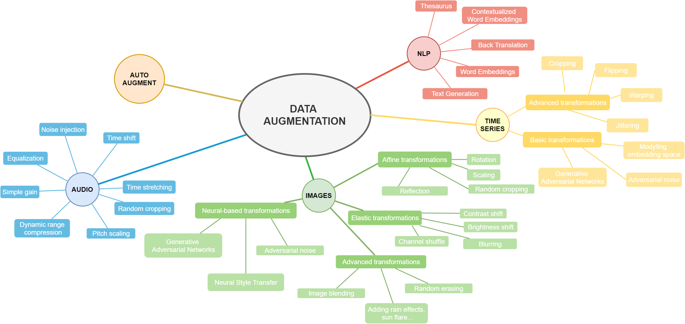

  

# Data augmentation
List of useful data augmentation resources. You will find here some links to more or less popular github repos :sparkles:, libraries, papers :books: and other information.

Do you like it? Feel free to :star: !
Feel free to pull request!

* [Introduction](README.md#Introduction)
* [Repositories](README.md#Repositories)
	* [Computer vision](README.md#Computer-vision)
	* [NLP](README.md#Natural-Language-Processing)
	* [Audio](README.md#Audio)
	* [Time series](README.md#Time-series)
	* [AutoAugment](README.md#AutoAugment)
* [Papers](papers.md)
* [Other - challenges, workshops, tutorials, books](README.md#Other)

# Introduction
Data augmentation can be simply described as any method that makes our dataset larger. To create more images for example, we could zoom the in and save a result, we could change the brightness of the image or rotate it. To get bigger sound dataset we could try raise or lower the pitch of the audio sample or slow down/speed up.
Example data augmentation techniques are presented on the diagram below.

## DATA AUGMENTATION
* ### Images augmentation
	* Affine transformations
		* Rotation
		* Scaling
		* Random cropping
		* Reflection
	* Elastic transformations
		* Contrast shift
		* Brightness shift
		* Blurring
		* Channel shuffle
	* Advanced transformations
		* Random erasing
		* Adding rain effects, sun flare...
		* Image blending
	* Neural-based transformations
		* Adversarial noise
		* Neural Style Transfer
		* Generative Adversarial Networks
* ### Audio augmentation
	* Noise injection
	* Time shift
	* Time stretching
	* Random cropping
	* Pitch scaling
	* Dynamic range compression
	* Simple gain
	* Equalization
* ### Natural Language Processing augmentation
	* Thesaurus
	* Text Generation
	* Back Translation
	* Word Embeddings
	* Contextualized Word Embeddings
	* Voice conversion
* ### Time Series Data Augmentation 
	* Basic approaches
		* Warping
		* Jittering
		* Perturbing
	* Advanced approches
		* Embedding space
		* GAN/Adversarial
		* RL/Meta-Learning
* ### Automatic Augmentation (AutoAugment)

If you wish to cite us, you can cite followings paper of your choice:  [Style transfer-based image synthesis as an efficient regularization technique in deep learning](https://ieeexplore.ieee.org/document/8864616) or [Data augmentation for improving deep learning in image classification problem](https://ieeexplore.ieee.org/document/8388338).

# Repositories

## Computer vision

#### - [albumentations](https://github.com/albu/albumentations)  is a python library with a set of useful, large and diverse data augmentation methods. It offers over 30 different types of augmentations, easy and ready to use. Moreover, as the authors prove, the library is faster than other libraries on most of the transformations. 

Example jupyter notebooks:
* [All in one showcase notebook](https://github.com/albu/albumentations_examples/blob/master/notebooks/showcase.ipynb)
* [Classification](https://github.com/albu/albumentations_examples/blob/master/notebooks/example.ipynb),
* [Object detection](https://github.com/albu/albumentations_examples/blob/master/notebooks/example_bboxes.ipynb),  [image segmentation](https://github.com/albu/albumentations_examples/blob/master/notebooks/example_kaggle_salt.ipynb) and  [keypoints](https://github.com/albu/albumentations_examples/blob/master/notebooks/example_keypoints.ipynb)
* Others - [Weather transforms ](https://github.com/albu/albumentations_examples/blob/master/notebooks/example_weather_transforms.ipynb),
 [Serialization](https://github.com/albu/albumentations_examples/blob/master/notebooks/serialization.ipynb),
 [Replay/Deterministic mode](https://github.com/albu/albumentations_examples/blob/master/notebooks/replay.ipynb),  [Non-8-bit images](https://github.com/albu/albumentations_examples/blob/master/notebooks/example_16_bit_tiff.ipynb)

Example tranformations:

#### - [imgaug](https://github.com/aleju/imgaug)  - is another very useful and widely used python library. As authors describe: *it helps you with augmenting images for your machine learning projects. It converts a set of input images into a new, much larger set of slightly altered images.* It offers many augmentation techniques such as affine transformations, perspective transformations, contrast changes, gaussian noise, dropout of regions, hue/saturation changes, cropping/padding, blurring.

Example jupyter notebooks:
* [Load and Augment an Image](https://nbviewer.jupyter.org/github/aleju/imgaug-doc/blob/master/notebooks/A01%20-%20Load%20and%20Augment%20an%20Image.ipynb)
* [Multicore Augmentation](https://nbviewer.jupyter.org/github/aleju/imgaug-doc/blob/master/notebooks/A03%20-%20Multicore%20Augmentation.ipynb)
 * Augment and work with: [Keypoints/Landmarks](https://nbviewer.jupyter.org/github/aleju/imgaug-doc/blob/master/notebooks/B01%20-%20Augment%20Keypoints.ipynb),
    [Bounding Boxes](https://nbviewer.jupyter.org/github/aleju/imgaug-doc/blob/master/notebooks/B02%20-%20Augment%20Bounding%20Boxes.ipynb),
    [Polygons](https://nbviewer.jupyter.org/github/aleju/imgaug-doc/blob/master/notebooks/B03%20-%20Augment%20Polygons.ipynb),
    [Line Strings](https://nbviewer.jupyter.org/github/aleju/imgaug-doc/blob/master/notebooks/B06%20-%20Augment%20Line%20Strings.ipynb),
    [Heatmaps](https://nbviewer.jupyter.org/github/aleju/imgaug-doc/blob/master/notebooks/B04%20-%20Augment%20Heatmaps.ipynb),
    [Segmentation Maps](https://nbviewer.jupyter.org/github/aleju/imgaug-doc/blob/master/notebooks/B05%20-%20Augment%20Segmentation%20Maps.ipynb) 

Example tranformations:

#### - [Kornia](https://github.com/kornia/kornia)  - is a differentiable computer vision library for PyTorch. It consists of a set of routines and differentiable modules to solve generic computer vision problems. At its core, the package uses PyTorch as its main backend both for efficiency and to take advantage of the reverse-mode auto-differentiation to define and compute the gradient of complex functions.

At a granular level, Kornia is a library that consists of the following components:

| **Component**                                                                    | **Description**                                                                                                                       |
|----------------------------------------------------------------------------------|---------------------------------------------------------------------------------------------------------------------------------------|
| [kornia](https://kornia.readthedocs.io/en/latest/index.html)                     | a Differentiable Computer Vision library, with strong GPU support                                                                     |
| [kornia.augmentation](https://kornia.readthedocs.io/en/latest/augmentation.html) | a module to perform data augmentation in the GPU                                                                                      |
| [kornia.color](https://kornia.readthedocs.io/en/latest/color.html)               | a set of routines to perform color space conversions                                                                                  |
| [kornia.contrib](https://kornia.readthedocs.io/en/latest/contrib.html)           | a compilation of user contrib and experimental operators                                                                              |
| [kornia.enhance](https://kornia.readthedocs.io/en/latest/enhance.html)           | a module to perform normalization and intensity transformation                                                                        |
| [kornia.feature](https://kornia.readthedocs.io/en/latest/feature.html)           | a module to perform feature detection                                                                                                 |
| [kornia.filters](https://kornia.readthedocs.io/en/latest/filters.html)           | a module to perform image filtering and edge detection                                                                                |
| [kornia.geometry](https://kornia.readthedocs.io/en/latest/geometry.html)         | a geometric computer vision library to perform image transformations, 3D linear algebra and conversions using different camera models |
| [kornia.losses](https://kornia.readthedocs.io/en/latest/losses.html)             | a stack of loss functions to solve different vision tasks                                                                             |
| [kornia.morphology](https://kornia.readthedocs.io/en/latest/morphology.html)     | a module to perform morphological operations                                                                                          |
| [kornia.utils](https://kornia.readthedocs.io/en/latest/utils.html)               | image to tensor utilities and metrics for vision problems                                                                             |

#### - [UDA](https://github.com/google-research/uda) - a simple data augmentation tool for image files, intended for use with machine learning data sets. The tool scans a directory containing image files, and generates new images by performing a specified set of augmentation operations on each file that it finds. This process multiplies the number of training examples that can be used when developing a neural network, and should significantly improve the resulting network's performance, particularly when the number of training examples is relatively small.
The details are avaible here: [UNSUPERVISED DATA AUGMENTATION FOR CONSISTENCY TRAINING](https://arxiv.org/pdf/1904.12848.pdf)

#### - [Data augmentation for object detection](https://github.com/Paperspace/DataAugmentationForObjectDetection)  - Repository contains a code for the paper [space tutorial series on adapting data augmentation methods for object detection tasks](https://blog.paperspace.com/data-augmentation-for-bounding-boxes/). They support a lot of data augmentations, like Horizontal Flipping, Scaling, Translation, Rotation, Shearing, Resizing.

#### - [FMix - Understanding and Enhancing Mixed Sample Data Augmentation](https://github.com/ecs-vlc/FMix)  This repository contains the official implementation of the paper ['Understanding and Enhancing Mixed Sample Data Augmentation'](https://arxiv.org/abs/2002.12047)

#### - [Super-AND](https://github.com/super-AND/super-AND)  - This repository is the Pytorch implementation of "A Comprehensive Approach to Unsupervised Embedding Learning based on AND Algorithm. 

#### - [vidaug](https://github.com/okankop/vidaug)  - This python library helps you with augmenting videos for your deep learning architectures. It converts input videos into a new, much larger set of slightly altered videos.

#### - [Image augmentor](https://github.com/codebox/image_augmentor)  - This is a simple python data augmentation tool for image files, intended for use with machine learning data sets. The tool scans a directory containing image files, and generates new images by performing a specified set of augmentation operations on each file that it finds. This process multiplies the number of training examples that can be used when developing a neural network, and should significantly improve the resulting network's performance, particularly when the number of training examples is relatively small.

#### - [torchsample](https://github.com/ncullen93/torchsample)  - this python package provides High-Level Training, Data Augmentation, and Utilities for Pytorch. This toolbox provides data augmentation methods, regularizers and other utility functions. These transforms work directly on torch tensors:
* Compose()
* AddChannel()
* SwapDims()
* RangeNormalize()
* StdNormalize()
* Slice2D()
* RandomCrop()
* SpecialCrop()
* Pad()
* RandomFlip()

#### - [Random erasing](https://github.com/zhunzhong07/Random-Erasing)  - The code is based on the paper: https://arxiv.org/abs/1708.04896. The Absract:

In this paper, we introduce Random Erasing, a new data augmentation method for training the convolutional neural network (CNN). In training, Random Erasing randomly selects a rectangle region in an image and erases its pixels with random values. In this process, training images with various levels of occlusion are generated, which reduces the risk of over-fitting and makes the model robust to occlusion. Random Erasing is parameter learning free, easy to implement, and can be integrated with most of the CNN-based recognition models. Albeit simple, Random Erasing is complementary to commonly used data augmentation techniques such as random cropping and flipping, and yields consistent improvement over strong baselines in image classification, object detection and person re-identification. Code is available at: this https URL.

#### - [data augmentation in C++](https://github.com/takmin/DataAugmentation) -  Simple image augmnetation program transform input images with rotation, slide, blur, and noise to create training data of image recognition.

#### - [Data augmentation with GANs](https://github.com/AntreasAntoniou/DAGAN)  - This repository contain files with Generative Adversarial Network, which can be used to successfully augment the dataset. This is an implementation of DAGAN as described in https://arxiv.org/abs/1711.04340. The implementation provides data loaders, model builders, model trainers, and synthetic data generators for the Omniglot and VGG-Face datasets.

#### - [Joint Discriminative and Generative Learning](https://github.com/NVlabs/DG-Net)  - This repo is for Joint Discriminative and Generative Learning for Person Re-identification (CVPR2019 Oral). The author proposes an end-to-end training network that simultaneously generates more training samples and conducts representation learning. Given N real samples, the network could generate O(NxN) high-fidelity samples.

[[Project]](http://zdzheng.xyz/DG-Net/) [[Paper]](https://arxiv.org/abs/1904.07223) [[YouTube]](https://www.youtube.com/watch?v=ubCrEAIpQs4) [[Bilibili]](https://www.bilibili.com/video/av51439240) [[Poster]](http://zdzheng.xyz/images/DGNet_poster.pdf)
[[Supp]](http://jankautz.com/publications/JointReID_CVPR19_supp.pdf)

#### - [White-Balance Emulator for Color Augmentation](https://github.com/mahmoudnafifi/WB_color_augmenter)  - Our augmentation method can accurately emulate realistic color constancy degradation. Existing color augmentation methods often generate unrealistic colors which rarely happen in reality (e.g., green skin or purple grass). More importantly, the visual appearance of existing color augmentation techniques does not well represent the color casts produced by incorrect WB applied onboard cameras, as shown below. [python] [matlab]

#### - [DocCreator](https://github.com/DocCreator/DocCreator)  - is an open source, cross-platform software allowing to generate synthetic document images and the accompanying groundtruth. Various degradation models can be applied on original document images to create virtually unlimited amounts of different images.
A multi-platform and open-source software able to create synthetic image documents with ground truth.

#### - [OnlineAugment](https://github.com/zhiqiangdon/online-augment)  - implementation in PyTorch
- More automatic than AutoAugment and related 
  - Towards fully automatic (STN and VAE, No need to specify the image primitives). 
  - Broad domains (natural, medical images, etc). 
  - Diverse tasks (classification, segmentation, etc). 
- Easy to use 
  - One-stage training (user-friendly). 
  - Simple code (single GPU training, no need for parallel optimization). 
- Orthogonal to AutoAugment and related 
  - Online v.s. Offline (Joint optimization, no expensive offline policy searching). 
  - State-of-the-art performance (in combination with AutoAugment). 

#### - [Augraphy](https://github.com/sparkfish/augraphy)  - is a Python library that creates multiple copies of original documents though an augmentation pipeline that randomly distorts each copy -- degrading the clean version into dirty and realistic copies rendered through synthetic paper printing, faxing, scanning and copy machine processes.

#### - [Data Augmentation optimized for GAN (DAG)](https://github.com/sutd-visual-computing-group/dag-gans)  - implementation in PyTorch and Tensorflow
DAG-GAN provide simple implementations of the DAG modules in both PyTorch and TensorFlow, which can be easily integrated into any GAN models to improve the performance, especially in the case of limited data. We only illustrate some augmentation techniques (rotation, cropping, flipping, ...) as discussed in our paper, but our DAG is not limited to these augmentations. The more augmentation to be used, the better improvements DAG enhances the GAN models. It is also easy to design your augmentations within the modules. However, there may be a trade-off between the numbers of many augmentations to be used in DAG and the computational cost.

## Natural Language Processing

#### - [nlpaug](https://github.com/makcedward/nlpaug)   - This python library helps you with augmenting nlp for your machine learning projects. Visit this introduction to understand about [Data Augmentation in NLP](https://towardsdatascience.com/data-augmentation-in-nlp-2801a34dfc28). `Augmenter` is the basic element of augmentation while `Flow` is a pipeline to orchestra multi augmenter together.

Features:
 *   Generate synthetic data for improving model performance without manual effort
 *   Simple, easy-to-use and lightweight library. Augment data in 3 lines of code
 *   Plug and play to any neural network frameworks (e.g. PyTorch, TensorFlow)
 *   Support textual and audio input

#### - [TextAttack 🐙](https://github.com/QData/TextAttack)   - TextAttack is a Python framework for adversarial attacks, data augmentation, and model training in NLP.
Many of the components of TextAttack are useful for data augmentation. The `textattack.Augmenter` class
uses a transformation and a list of constraints to augment data. We also offer five built-in recipes
for data augmentation [source:QData/TextAttack](https://github.com/QData/TextAttack):
- `textattack.WordNetAugmenter` augments text by replacing words with WordNet synonyms
- `textattack.EmbeddingAugmenter` augments text by replacing words with neighbors in the counter-fitted embedding space, with a constraint to ensure their cosine similarity is at least 0.8
- `textattack.CharSwapAugmenter` augments text by substituting, deleting, inserting, and swapping adjacent characters
- `textattack.EasyDataAugmenter` augments text with a combination of word insertions, substitutions and deletions.
- `textattack.CheckListAugmenter` augments text by contraction/extension and by substituting names, locations, numbers.
- `textattack.CLAREAugmenter` augments text by replacing, inserting, and merging with a pre-trained masked language model.

#### - [EDA NLP](https://github.com/jasonwei20/eda_nlp)   - **EDA** is an **e**asy **d**ata **a**ugmentation techniques for boosting performance on text classification tasks. These are a generalized set of data augmentation techniques that are easy to implement and have shown improvements on five NLP classification tasks, with substantial improvements on datasets of size `N < 500`. While other techniques require you to train a language model on an external dataset just to get a small boost, we found that simple text editing operations using EDA result in good performance gains. Given a sentence in the training set, we perform the following operations:

- **Synonym Replacement (SR):** Randomly choose *n* words from the sentence that are not stop words. Replace each of these words with one of its synonyms chosen at random.
- **Random Insertion (RI):** Find a random synonym of a random word in the sentence that is not a stop word. Insert that synonym into a random position in the sentence. Do this *n* times.
- **Random Swap (RS):** Randomly choose two words in the sentence and swap their positions. Do this *n* times.
- **Random Deletion (RD):** For each word in the sentence, randomly remove it with probability *p*.

#### - [NL-Augmenter 🦎 → 🐍](https://github.com/GEM-benchmark/NL-Augmenter)   - The NL-Augmenter is a collaborative effort intended to add transformations of datasets dealing with natural language. Transformations augment text datasets in diverse ways, including: randomizing names and numbers, changing style/syntax, paraphrasing, KB-based paraphrasing ... and whatever creative augmentation you contribute. We invite submissions of transformations to this framework by way of GitHub pull request, through August 31, 2021. All submitters of accepted transformations (and filters) will be included as co-authors on a paper announcing this framework.

#### - [Contextual data augmentation](https://github.com/pfnet-research/contextual_augmentation)   - Contextual augmentation is a domain-independent data augmentation for text classification tasks. Texts in supervised dataset are augmented by replacing words with other words which are predicted by a label-conditioned bi-directional language model. 
This repository contains a collection of scripts for an experiment of [Contextual Augmentation](https://arxiv.org/pdf/1805.06201.pdf).

 

#### - [Wiki Edits](https://github.com/snukky/wikiedits)   - A collection of scripts for automatic extraction of edited sentences from text edition histories, such as Wikipedia revisions. It was used to create the WikEd Error Corpus --- a corpus of corrective Wikipedia edits. The corpus has been prepared for two languages: Polish and English. Can be used as a dictionary-based augmentatioon to insert user-induced errors.

#### - [Text AutoAugment (TAA)](https://github.com/lancopku/text-autoaugment)   - Text AutoAugment is a learnable and compositional framework for data augmentation in NLP. The proposed algorithm automatically searches for the optimal compositional policy, which improves the diversity and quality of augmented samples.

## Audio
#### - [SpecAugment with Pytorch](https://github.com/zcaceres/spec_augment)  - (https://ai.googleblog.com/2019/04/specaugment-new-data-augmentation.html) is a state of the art data augmentation approach for speech recognition. It supports augmentations such as time wrap, time mask, frequency mask or all above combined.

#### - [Audiomentations](https://github.com/iver56/audiomentations)  - A Python library for audio data augmentation. Inspired by albumentations. Useful for machine learning. It allows to use effects such as: Compose, AddGaussianNoise, TimeStretch, PitchShift and Shift.

#### - [MUDA](https://github.com/bmcfee/muda)  - A library for Musical Data Augmentation. Muda package implements annotation-aware musical data augmentation, as described in the muda paper.
The goal of this package is to make it easy for practitioners to consistently apply perturbations to annotated music data for the purpose of fitting statistical models.

#### - [tsaug](https://github.com/arundo/tsaug)  - 
 is a Python package for time series augmentation. It offers a set of augmentation methods for time series, as well as a simple API to connect multiple augmenters into a pipeline. Can be used for audio augmentation.

#### - [wav-augment](https://github.com/facebookresearch/WavAugment)  - performs data augmentation on audio data. 
The audio data is represented as [pytorch](https://pytorch.org/) tensors. 
It is particularly useful for speech data. 
Among others, it implements the augmentations that we found to be most useful for self-supervised learning 
(_Data Augmenting Contrastive Learning of Speech Representations in the Time Domain_, E. Kharitonov, M. Rivière, G. Synnaeve, L. Wolf, P.-E. Mazaré, M. Douze, E. Dupoux. [[arxiv]](https://arxiv.org/abs/2007.00991)):

* Pitch randomization,
* Reverberation,
* Additive noise,
* Time dropout (temporal masking),
* Band reject,
* Clipping

## Time series
#### - [tsaug](https://github.com/arundo/tsaug) 
 is a Python package for time series augmentation. It offers a set of augmentation methods for time series, as well as a simple API to connect multiple augmenters into a pipeline. 

 Example augmenters:
 * random time warping 5 times in parallel,
 * random crop subsequences with length 300, 
 * random quantize to 10-, 20-, or 30- level sets, 
 * with 80% probability , random drift the signal up to 10% - 50%,
 * with 50% probability, reverse the sequence.

## AutoAugment
Automatic Data Augmentation is a family of algorithms that searches for the policy of augmenting the dataset for solivng the selcted task.

Github repositories:
* [Text AutoAugment (TAA)](https://github.com/lancopku/text-autoaugment) 
* [Official Fast AutoAugment implementation in PyTorch](https://github.com/kakaobrain/fast-autoaugment) 
* [AutoCLINT - Automatic Computationally LIght Network Transfer (A specially designed light version of Fast AutoAugment is implemented to adapt to various tasks under limited resources)](https://github.com/kakaobrain/autoclint) 
* [Population Based Augmentation (PBA)](https://github.com/arcelien/pba) 
* [AutoAugment: Learning Augmentation Policies from Data (Keras and Tensorflow)](https://github.com/hongdayu/autoaugment) 
* [AutoAugment: Learning Augmentation Policies from Data (PyTorch)](https://github.com/DeepVoltaire/AutoAugment) 
* [AutoAugment: Learning Augmentation Policies from Data (PyTorch, another implementation)](https://github.com/4uiiurz1/pytorch-auto-augment) 

# Other
## Challenges
* [AutoDL 2019 (NeurIPS AutoDL challenges - includes AutoAugment)](https://autodl.chalearn.org/) - Machine Learning and in particular Deep Learning has achieved considerable successes in recent years and an ever-growing number of disciplines rely on it. However, this success crucially relies on human intervention in many steps (data pre-processing, feature engineering, model selection, hyper-parameter optimization, etc.). As the complexity of these tasks is often beyond non-experts, the rapid growth of machine learning applications has created a demand for off-the-shelf or reusable methods, which can be used easily and without expert knowledge. **The objective of AutoML (Automated Machine Learning) challenges is to provide "universal learning machines" (deep learning or others), which can learn and make predictions without human intervention (blind testing).** 

## Workshops
* [Interactive Labeling and Data Augmentation for Vision
ICCV 2021 Workshop](https://ildav-workshop.github.io/program/) - The workshop on Interactive Labeling and Data Augmentation for Vision (ILDAV) wishes to address novel ways to solve computer vision problems where large quantities of labeled image data may not be readily available. It is important that datasets of sufficient size can be quickly and cheaply acquired and labeled. More specifically, we are interested in solutions to this problem that make use of (i) few-click and interactive data annotation, where machine learning is used to enhance human annotation skill, (ii) synthetic data generation, where one uses artificially generated data to augment real datasets, and (iii) weak supervision, where auxiliary or weak signals are used instead of (or to complement) manual labels.

More broadly, we aim at fostering a collaboration between academia and industry in terms of leveraging machine learning research and human-in-the-loop, interactive labeling to quickly build datasets that will enable the use of powerful deep models in all problems of computer vision.

The workshop topics include (but are not limited to):

* Interactive and Few-click annotation
* Data augmentation
* Synthetic data for training models
* Weak supervision
* Human-in-the-loop learning 
